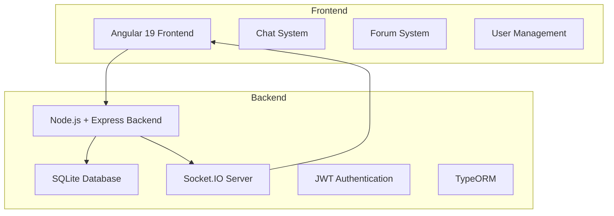
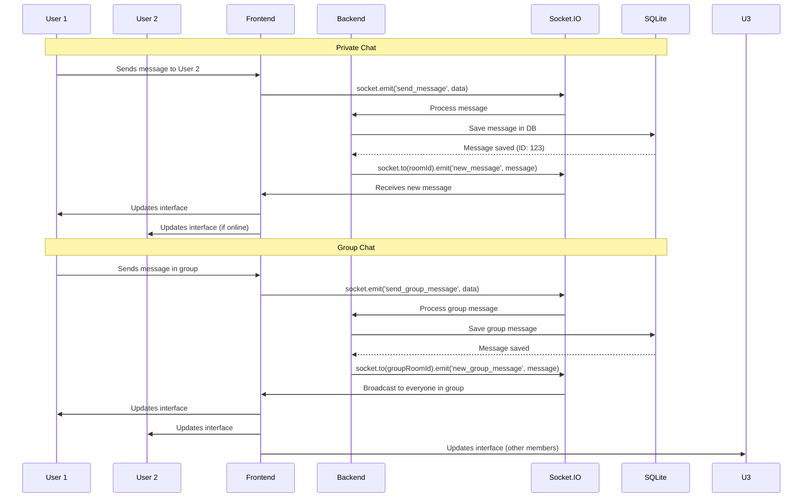
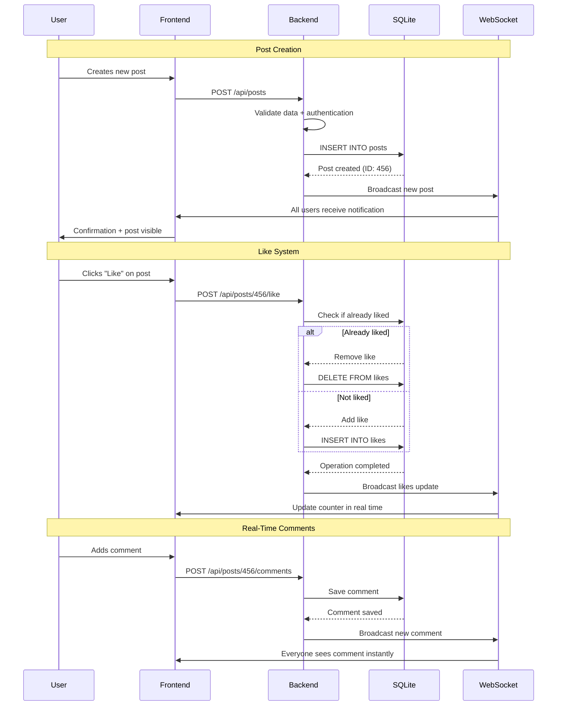
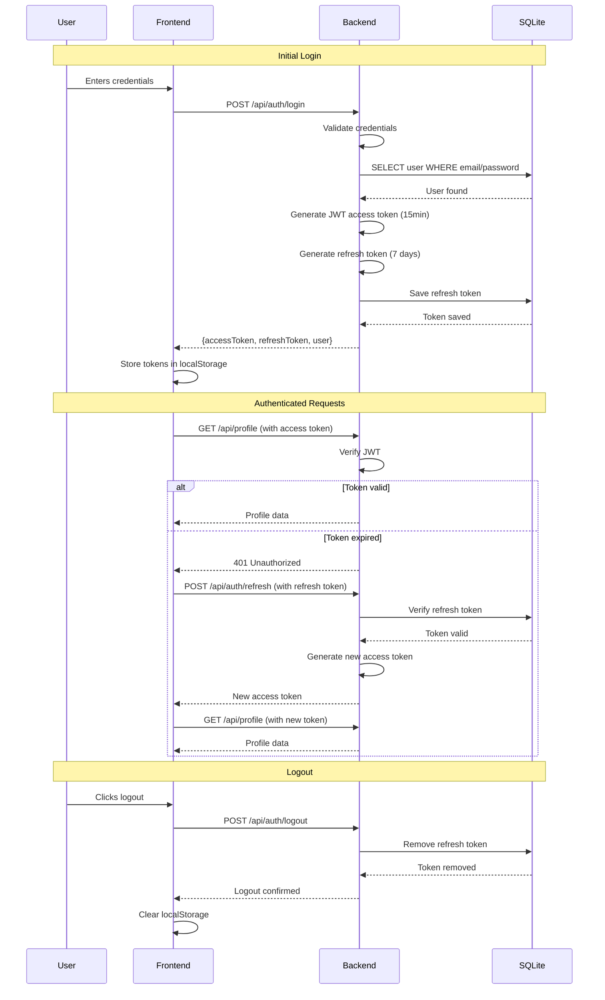
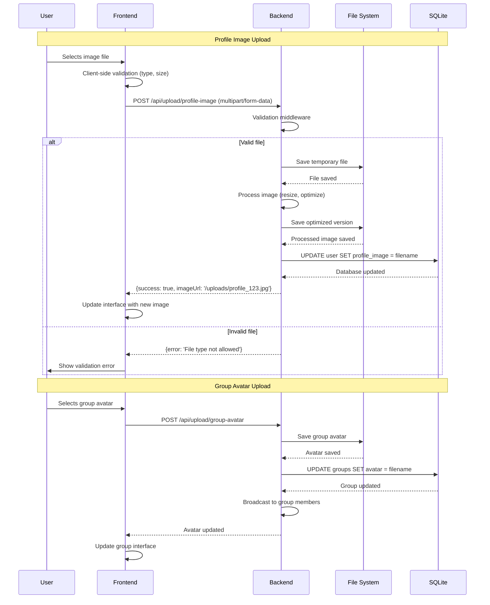

# 🌌 AA Space — Real-Time Community Platform

## 🚀 Overview

**AA Space** is a complete community and real-time communication platform built with a modern full-stack architecture. The solution provides a safe environment to share experiences, with an advanced chat system, interactive forum, and user management— all integrated into a responsive web experience.

### 🎯 Key Features

- **Complete Chat System:** Private and group conversations with advanced control
- **Interactive Forum:** Posts, comments, and like system
- **User Management:** Customizable profiles with image uploads
- **Real-Time Communication:** Via WebSockets with Socket.IO
- **Modern Interface:** Responsive design with Angular 19
- **Robust Backend:** RESTful API with Node.js and Express

## 🏗️ System Architecture



## 🔄 Real-Time Communication Flows

### Hybrid Chat System (Private + Group)



### Interactive Forum System



## 🔐 Authentication and Sessions

### JWT Flow with Refresh Tokens



## 🛠️ Tech Stack

### Frontend

- **Angular 19** - Enterprise framework with TypeScript 5.7
- **RxJS 7.8** - Reactive programming
- **Socket.IO Client** - WebSocket communication
- **CSS3** - Responsive, modern interface

### Backend

- **Node.js** - Server-side JavaScript runtime
- **Express.js 4.18** - Web framework
- **TypeScript 5.8** - Static typing
- **Socket.IO 4.8** - WebSocket server

### Database

- **SQLite3** - Embedded relational database
- **TypeORM 0.3.22** - Modern ORM with TypeScript
- **Migrations** - Schema version control

### Security & Authentication

- **JWT** - Secure tokens for authentication
- **bcrypt** - Password hashing
- **CORS** - Cross-origin access control
- **Input Validation** - Robust data validation

### DevOps & Development

- **TypeScript Compiler** - Type-safe compilation
- **ts-node** - TypeScript execution in development
- **nodemon** - Hot reload
- **Concurrently** - Parallel process execution

## 🎯 Technical Features

### 1. Advanced Chat System

- **Private Conversations:** One-to-one with persistent history
- **Group Chat:** Multiple participants with customizable avatars
- **Real Time:** Instant communication via WebSockets
- **Message Status:** Delivery and read receipts in real time
- **Participant Management:** Add/remove users

### 2. Forum System

- **Posts and Comments:** Complete interaction system
- **Like System:** For posts and comments
- **Real-Time Updates:** Instant notifications
- **Content Moderation:** Administrative control

### 3. User Management

- **JWT Authentication:** Secure stateless system
- **Image Upload:** Profile pictures and group avatars
- **Contact Information:** Email and phone
- **Role System:** Admins and regular users

### 4. File Upload and Management

- **File Validation:** Allowed types and sizes
- **Local Storage:** Integration with file system
- **Image Processing:** Automatic optimization

#### Upload Flow with Validation



## 🔧 Technical Implementations

### WebSocket Communication

```typescript
// Socket.IO server
io.on('connection', (socket) => {
  socket.on('join_room', (roomId) => {
    socket.join(roomId);
  });
  
  socket.on('send_message', (data) => {
    io.to(data.roomId).emit('new_message', data);
  });
});
```

### TypeORM Entities

```typescript
@Entity()
export class User {
  @PrimaryGeneratedColumn()
  id: number;
  
  @Column({ unique: true })
  username: string;
  
  @OneToMany(() => ChatMessage, message => message.sender)
  messages: ChatMessage[];
}
```

### JWT Authentication

```typescript
// Authentication middleware
const authenticateToken = (req, res, next) => {
  const token = req.headers['authorization'];
  if (!token) return res.sendStatus(401);
  
  jwt.verify(token, process.env.JWT_SECRET, (err, user) => {
    if (err) return res.sendStatus(403);
    req.user = user;
    next();
  });
};
```

## 📊 Technical Differentials

### Implemented Innovations

1. **Hybrid chat system** with private and group conversations
2. **WebSocket integration** for real-time communication
3. **Full TypeScript architecture** with static typing
4. **Upload system** with security validation
5. **Responsive interface** adaptable to all devices

### Skills Demonstrated

- **Full-stack Development** with Angular and Node.js
- **Real-time Communication** with WebSockets
- **TypeScript** on frontend and backend
- **Modern ORM** with TypeORM
- **Secure Authentication** with JWT
- **Component Architecture** with Angular
- **Reactive Programming** with RxJS
- **Database Versioning** control

## 🚀 Final Result

**AA Space** demonstrates advanced capability in:

- **Modern Full-stack Development**
- **Real-Time Communication** with WebSockets
- **TypeScript Architecture** with type safety
- **Complex Chat Systems**
- **User Management** and authentication
- **Responsive and modern Interface**

A complete solution that brings together modern market technologies to create a robust and scalable community experience.
