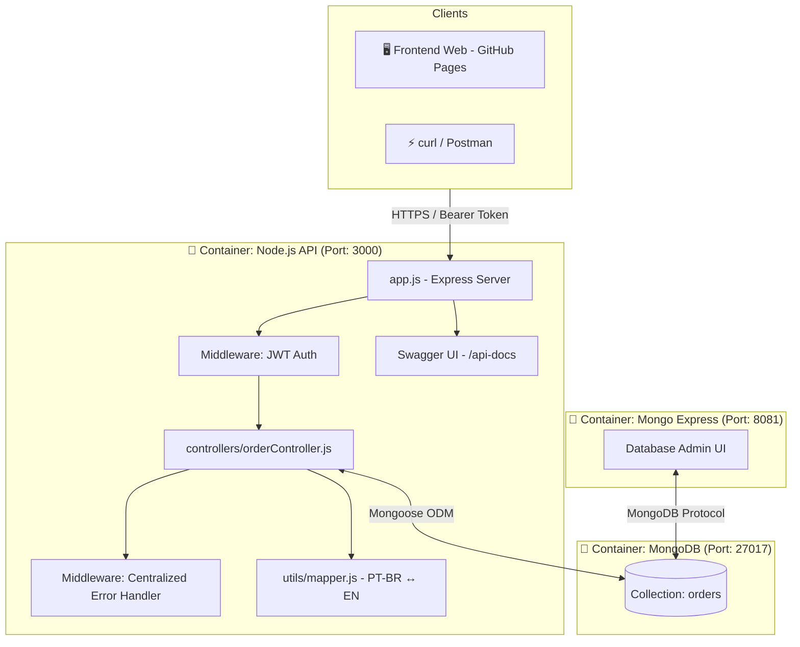
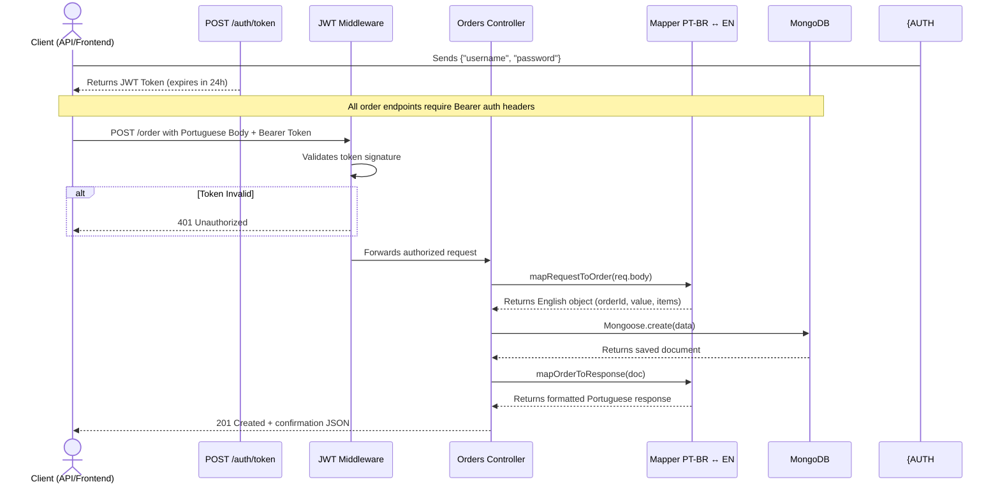

# 🛒 Order Management API — Jitterbit Technical Challenge

## 🚀 Overview

The **Order Management API** is a complete enterprise solution developed as a technical assessment for **Jitterbit**. The project consists of a RESTful backend API for managing customer orders featuring JWT authentication, inline Swagger documentation, database persistence on MongoDB, and a web frontend panel. The core differentiator lies in a custom-built **bidirectional data mapper** that translates payload properties written in Portuguese (matching legacy client configurations) into internal English schemas stored in the database, mapping them back to Portuguese when responding to requests.

### 🎯 Value Proposition

- **Transparent Field Mapping**: Easy integration for legacy systems using automated PT-BR ↔ EN translation.
- **Robust Security**: Access control secured by stateless JWT tokens with bcrypt-hashed credentials.
- **Interactive API Documentation**: Embedded Swagger UI built using JSDoc annotations directly on Express route endpoints.
- **Full Containerization**: Docker Compose orchestrating the Node API container, MongoDB database, and Mongo Express administrator interface.
- **Always-On Cloud Deploy**: Self-healing deployment on Oracle Cloud Infrastructure (Always Free VPS) with strict memory thresholds.

## 🏗️ System Architecture Overview



### Main System Flow

1. The client sends a `POST /auth/token` request providing user credentials to receive a temporary JWT.
2. To submit an order, the client sends a `POST /order` request containing an `Authorization: Bearer <token>` header and a payload written in Portuguese (e.g. `numeroPedido`, `valorTotal`).
3. The auth middleware intercepts the request, verifying the JWT signature and expiration.
4. The orders controller forwards the payload properties to `mapper.js` to translate them to English keys (`orderId`, `value`).
5. The Mongoose ODM validates constraints and writes the order to the MongoDB collection.
6. The controller translates the persisted database document back to Portuguese and responds with status `201 Created`.

## 🔄 Order Creation Flow



## 🛠️ Tech Stack

### API Backend

- **Node.js 18** - Asynchronous JavaScript runtime environment.
- **Express 4.18** - Minimalist and highly flexible web routing framework.
- **MongoDB & Mongoose 7** - NoSQL document store and Object Document Mapper (ODM) enforcing strict schema validation.
- **jsonwebtoken (JWT)** - Stateless token auth implementation.
- **bcryptjs** - Secure hash algorithm for administrative user passwords.
- **Swagger UI Express** - Dynamic OpenAPI documentation generator.

### Frontend Web (Dashboard)

- **Vanilla JavaScript (ES6) & HTML5/CSS3** - Pure, dependency-free single page application (SPA) hosted on GitHub Pages.
- **Tailwind CSS (via CDN)** - Modern utility-first styling.

### DevOps & Containerization

- **Docker & Docker Compose** - Containerization packaging for the entire application bundle.
- **Oracle Cloud Infrastructure (OCI)** - Ampere Core VPS with 1GB RAM under Always Free tier.

## 🎯 Technical Features

1. **Anti-Corruption Translation Layer**: Bidirectional field translations.
2. **Centralized Error Handling**: Global middleware handling Mongoose validation issues, duplicate keys (MongoDB error 11000), or bad object IDs, return corresponding HTTP codes (400, 409, etc.).
3. **Container Resource Limits**: Docker Compose configurations constraining containers to low-RAM environments (API limited to 150MB, MongoDB to 450MB) to fit on a 1GB VPS.
4. **Automated Pipeline**: A deployment pipeline batch script (`deploy.bat`) that builds, pushes to Docker Hub, connects via SSH, pulls the container configuration, and restarts backend services.

## 🔧 Technical Implementations

### Bidirectional Mapper (`utils/mapper.js`)

```javascript
/**
 * Mapper responsible for translating incoming body keys (PT-BR)
 * to MongoDB fields (EN) and vice-versa.
 */

// Maps request body (Portuguese) to DB model (English)
const mapRequestToOrder = (body) => {
  return {
    orderId: body.numeroPedido,
    value: body.valorTotal,
    creationDate: new Date(body.dataCriacao),
    items: (body.items || []).map((item) => ({
      productId: Number(item.idItem),
      quantity: item.quantidadeItem,
      price: item.valorItem
    }))
  };
};

// Maps DB model (English) back to response payload (Portuguese)
const mapOrderToResponse = (order) => {
  return {
    numeroPedido: order.orderId,
    valorTotal: order.value,
    dataCriacao: order.creationDate,
    items: (order.items || []).map((item) => ({
      idItem: String(item.productId),
      quantidadeItem: item.quantity,
      valorItem: item.price
    }))
  };
};

module.exports = { mapRequestToOrder, mapOrderToResponse };
```

### Mongoose Constraints Validator (`models/Order.js`)

```javascript
const mongoose = require('mongoose');

const OrderItemSchema = new mongoose.Schema({
  productId: { type: Number, required: true },
  quantity: { type: Number, required: true, min: 1 },
  price: { type: Number, required: true, min: 0 }
}, { _id: false });

const OrderSchema = new mongoose.Schema({
  orderId: { type: String, required: true, unique: true },
  value: { type: Number, required: true, min: 0 },
  creationDate: { type: Date, required: true },
  items: { type: [OrderItemSchema], required: true, validate: [v => v.length > 0, 'Order must contain at least one item'] }
}, { versionKey: false });

module.exports = mongoose.model('Order', OrderSchema);
```

## 📊 Technical Differentiators

- **Resilient API Contracts**: Decouples API endpoints from the database schema, protecting internal fields from public visibility.
- **Docker Compose Memory Constraints**:
  ```yaml
  deploy:
    resources:
      limits:
        memory: 150M
  ```
- **Live Swagger Documentation (Swagger JSDoc)**: Code comments map directly to Swagger UI endpoints.

## 🚀 Final Result

The **Order Management API** delivers a clean, scalable design satisfying Jitterbit's requirements. It allows the integration of legacy systems using Portuguese contracts while enforcing design best practices in the database.

---

## 📋 Index

- [Features](#-features)
- [API Endpoints](#-api-endpoints)
- [Local Installation](#-local-installation)
- [Project Structure](#-project-structure)
- [Automated Deployment](#-automated-deployment)

---

## ✨ Features

- **Order CRUD**: Create, read, update, and delete orders.
- **Auth Middleware**: Secured by stateless JWT tokens.
- **Interactive Console**: Swagger UI for endpoint querying.
- **Mongo Express UI**: Web-based administration tool for MongoDB.

## 🔌 API Endpoints

**Production URL:** `http://134.65.250.48:3000`

| Method | Path | Authentication | Description |
|:---:|---|:---:|---|
| `POST` | `/auth/token` | None | Returns JWT token upon login |
| `POST` | `/order` | JWT (Bearer) | Inserts order (Portuguese payload) |
| `GET` | `/order/list` | JWT (Bearer) | Lists all order details |
| `GET` | `/order/:orderId` | JWT (Bearer) | Resolves single order details |
| `PUT` | `/order/:orderId` | JWT (Bearer) | Modifies order fields |
| `DELETE` | `/order/:orderId` | JWT (Bearer) | Deletes order entry from database |
| `GET` | `/api-docs` | None | Interactive Swagger UI |

## 🚀 Local Installation

### Prerequisites
- Docker & Docker Compose.

```bash
# 1. Clone the repository
git clone https://github.com/wmakeouthill/desafio_tecnico_jitterbit.git
cd desafio_tecnico_jitterbit

# 2. Add environment variables
cp .env.example .env

# 3. Start docker compose containers
docker compose up -d --build
```

### Local URLs
- **Node API**: `http://localhost:3000`
- **Swagger docs**: `http://localhost:3000/api-docs`
- **Mongo Express panel**: `http://localhost:8081`

## 📁 Project Structure

```text
desafio_tecnico_jitterbit/
├── src/
│   ├── app.js                   # Setup Express & middleware registry
│   ├── controllers/             # Orders CRUD logic & admin login
│   ├── middlewares/             # Error routing & JWT parser
│   ├── models/                  # Mongoose MongoDB schemas
│   ├── routes/                  # Express routing & Swagger metadata
│   └── utils/                   # Data translation mapper PT-BR ↔ EN
├── public/                      # Static client frontend files
├── docker-compose.yml           # Container configurations (local)
├── docker-compose.prod.yml      # Container limits (production)
├── Dockerfile                   # Node API Docker compilation instructions
└── deploy.bat                   # Deployment script
```

## 🚢 Automated Deployment

Execute the automated Windows deployment utility script:

```cmd
deploy.bat
```
This script compiles the API container image, publishes to Docker Hub, connects via SSH to Oracle Cloud, and triggers an orchestrated restart of containers.
