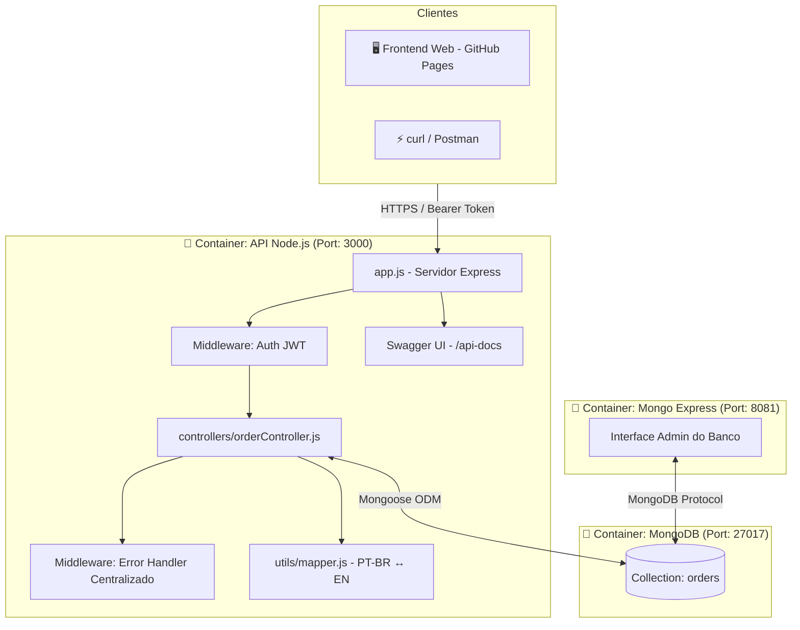
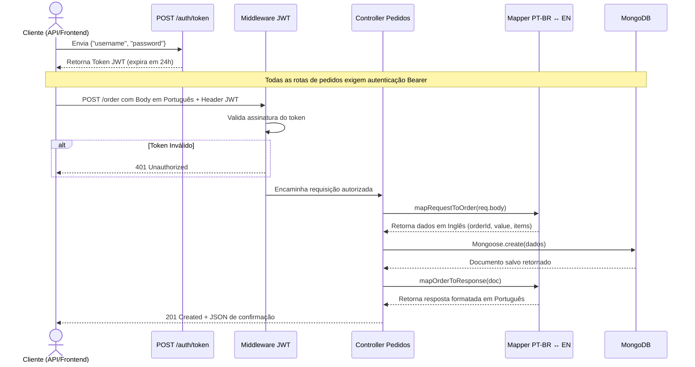

# 🛒 Order Management API — Desafio Técnico Jitterbit

## 🚀 Visão Geral

A **Order Management API** é uma solução completa desenvolvida como desafio técnico para a **Jitterbit**. O projeto consiste em uma API RESTful corporativa para gerenciamento de pedidos com autenticação JWT, documentação Swagger integrada, persistência em MongoDB, e um painel frontend web funcional. O core diferenciador do projeto está na implementação de um **data mapper bidirecional** inteligente que traduz payloads estruturados em português (compatíveis com sistemas legados da empresa) para o formato interno em inglês armazenado no banco de dados, respondendo de volta em português para o cliente.

### 🎯 Proposta de Valor

- **Mapeamento de Dados Transparente**: Integração simplificada de sistemas antigos legados por meio de tradução automatizada PT-BR ↔ EN.
- **Segurança Robusta**: Proteção de rotas utilizando tokens JWT baseados em criptografia hash de senhas com bcrypt.
- **Documentação de API Interativa**: Swagger UI integrada diretamente ao código Express utilizando anotações JSDoc.
- **Containerização Completa**: Docker Compose orquestrando o container da API Node, banco de dados MongoDB e o painel administrativo Mongo Express.
- **Infraestrutura Sempre Online**: Deploy automatizado em nuvem Oracle Cloud (Always Free VPS) com controle rígido de limites de memória.

## 🏗️ Arquitetura Geral do Sistema



### Fluxo de Funcionamento

1. O cliente realiza uma chamada `POST /auth/token` informando credenciais e recebe um token JWT temporário.
2. Para criar um pedido, o cliente envia uma requisição `POST /order` com cabeçalho `Authorization: Bearer <token>` e payload estruturado em português (ex: `numeroPedido`, `valorTotal`).
3. O middleware de autenticação intercepta a chamada, valida a assinatura e expiração do JWT.
4. O controller de pedidos delega para o módulo `mapper.js` a tradução do payload recebido para o formato em inglês (`orderId`, `value`).
5. O modelo do Mongoose valida os dados de entrada e persiste o pedido na coleção do MongoDB.
6. O controller traduz o documento do banco de volta para o formato em português e responde com status `201 Created`.

## 🔄 Fluxo de uma Requisição de Pedido



## 🛠️ Stack Tecnológica

### API Backend

- **Node.js 18** - Interpretador JavaScript assíncrono.
- **Express 4.18** - Framework web minimalista de alto desempenho.
- **MongoDB & Mongoose 7** - Banco de dados de documentos NoSQL e Modelador de Objetos (ODM) com schemas validados.
- **jsonwebtoken (JWT)** - Implementação de tokens de autenticação stateless.
- **bcryptjs** - Criptografia Hash para senhas de usuários administradores.
- **Swagger UI Express** - Geração interativa de páginas de documentação de rotas a partir de JSDoc.

### Frontend Web (Dashboard)

- **Vanilla JavaScript (ES6) & HTML5/CSS3** - Aplicação estática de página única (SPA) sem dependências pesadas, hospedada gratuitamente no GitHub Pages.
- **Tailwind CSS (via CDN)** - Estilização limpa e moderna.

### DevOps & Containerização

- **Docker & Docker Compose** - Empacotamento de toda a stack em containers isolados.
- **Oracle Cloud Infrastructure (OCI)** - VPS rodando Ubuntu sob especificações Always Free (1 Core Ampere, 1GB RAM).

## 🎯 Funcionalidades Técnicas

1. **Mapeador Bidirecional de Campos**: Tradução de payloads de entrada e saída.
2. **Tratamento Centralizado de Erros**: Middleware global que captura exceções, classifica erros de validação do Mongoose, chaves duplicadas (MongoDB erro 11000) ou IDs incorretos, respondendo com os devidos códigos HTTP (400, 409, etc.).
3. **Limitação de Recursos de Containers**: Arquivos Docker Compose parametrizados com limites rígidos de RAM (API a 150MB e MongoDB a 450MB) para caber na VPS Always Free de 1GB de RAM.
4. **Deploy Automatizado**: Pipeline em script `.bat` que realiza build da imagem, envia para o Docker Hub, acessa o servidor via SSH, atualiza os containers e reinicia os serviços de forma automatizada.

## 🔧 Implementações Técnicas

### Mapeador Bidirecional (`utils/mapper.js`)

```javascript
/**
 * Mapper responsável por transformar os dados recebidos no body (PT-BR)
 * para o formato armazenado no banco de dados (EN) e vice-versa.
 */

// Transforma o body do request (Português) para o modelo do banco (Inglês)
const mapRequestToOrder = (body) => {
  return {
    orderId: body.numeroPedido,
    value: body.valorTotal,
    creationDate: new Date(body.dataCriacao),
    items: (body.items || []).map((item) => ({
      productId: Number(item.idItem),
      quantity: item.quantidadeItem,
      price: item.valorItem
    }))
  };
};

// Transforma o modelo do banco (Inglês) de volta para o formato de resposta (Português)
const mapOrderToResponse = (order) => {
  return {
    numeroPedido: order.orderId,
    valorTotal: order.value,
    dataCriacao: order.creationDate,
    items: (order.items || []).map((item) => ({
      idItem: String(item.productId),
      quantidadeItem: item.quantity,
      valorItem: item.price
    }))
  };
};

module.exports = { mapRequestToOrder, mapOrderToResponse };
```

### Validador do Mongoose Schema (`models/Order.js`)

```javascript
const mongoose = require('mongoose');

const OrderItemSchema = new mongoose.Schema({
  productId: { type: Number, required: true },
  quantity: { type: Number, required: true, min: 1 },
  price: { type: Number, required: true, min: 0 }
}, { _id: false });

const OrderSchema = new mongoose.Schema({
  orderId: { type: String, required: true, unique: true },
  value: { type: Number, required: true, min: 0 },
  creationDate: { type: Date, required: true },
  items: { type: [OrderItemSchema], required: true, validate: [v => v.length > 0, 'O pedido deve ter pelo menos um item'] }
}, { versionKey: false });

module.exports = mongoose.model('Order', OrderSchema);
```

## 📊 Diferenciais Técnicos

- **Design de API Resiliente**: Evita exposição de nomes de campos internos do banco de dados na API pública, agindo como um mecanismo anti-corrupção (ACL).
- **Docker Compose com Memory Limit**:
  ```yaml
  deploy:
    resources:
      limits:
        memory: 150M
  ```
- **Documentação viva (Swagger JSDoc)**: Garante que alterações no código gerem atualizações automáticas na documentação REST (/api-docs).

## 🚀 Resultado Final

A **Order Management API** oferece uma solução empresarial robusta para o desafio proposto, mantendo a compatibilidade do sistema corporativo com contratos legados em português ao mesmo tempo em que implementa boas práticas de desenvolvimento no backend.

---

## 📋 Índice

- [Funcionalidades](#-funcionalidades)
- [Endpoints da API](#-endpoints-da-api)
- [Executando Localmente](#-executando-localmente)
- [Estrutura do Projeto](#-estrutura-do-projeto)
- [Deploy Automatizado](#-deploy-automatizado)

---

## ✨ Funcionalidades

- **CRUD de Pedidos**: Cadastro, leitura, atualização e exclusão física de registros de compras.
- **Autenticação Segura**: Geração de tokens JWT stateless.
- **Documentação de API**: Painel Swagger integrado para testes rápidos de requisições.
- **Painel Administrativo do Banco**: Mongo Express configurado para auditoria direta do banco MongoDB.

## 🔌 Endpoints da API

**Base URL em Produção:** `http://134.65.250.48:3000`

| Método | Rota | Autenticação | Descrição |
|:---:|---|:---:|---|
| `POST` | `/auth/token` | Nenhuma | Recebe credenciais de admin e retorna o Token JWT |
| `POST` | `/order` | JWT (Bearer) | Cria um novo pedido (Payload em Português) |
| `GET` | `/order/list` | JWT (Bearer) | Lista todos os pedidos cadastrados |
| `GET` | `/order/:orderId` | JWT (Bearer) | Obtém detalhes de um pedido por ID |
| `PUT` | `/order/:orderId` | JWT (Bearer) | Atualiza informações de um pedido |
| `DELETE` | `/order/:orderId` | JWT (Bearer) | Remove fisicamente um pedido do banco |
| `GET` | `/api-docs` | Nenhuma | Interface interativa do Swagger |

## 🚀 Executando Localmente

### Pré-requisitos
- Docker & Docker Compose instalados.

```bash
# 1. Clone o repositório
git clone https://github.com/wmakeouthill/desafio_tecnico_jitterbit.git
cd desafio_tecnico_jitterbit

# 2. Configure as variáveis de ambiente
cp .env.example .env

# 3. Inicie os containers em background
docker compose up -d --build
```

### URLs Locais
- **API Node**: `http://localhost:3000`
- **Swagger Docs**: `http://localhost:3000/api-docs`
- **Mongo Express UI**: `http://localhost:8081`

## 📁 Estrutura do Projeto

```text
desafio_tecnico_jitterbit/
├── src/
│   ├── app.js                   # Setup do Express e middlewares
│   ├── controllers/             # Lógica de negócio de pedidos e login
│   ├── middlewares/             # Tratamento de erro global e validação JWT
│   ├── models/                  # Schemas do MongoDB via Mongoose
│   ├── routes/                  # Rotas HTTP e anotações Swagger JSDoc
│   └── utils/                   # Tradutor Mapper PT-BR ↔ EN
├── public/                      # Site Frontend estático
├── docker-compose.yml           # Configuração de containers local
├── docker-compose.prod.yml      # Configuração com limites de memória
├── Dockerfile                   # Build da imagem Node da API
└── deploy.bat                   # Script de automação do deploy
```

## 🚢 Deploy Automatizado

O pipeline de deploy em produção é executado no Windows de forma simples:

```cmd
deploy.bat
```
Ele executa o empacotamento Docker da API, faz o push para o Docker Hub, conecta via SSH na VPS da Oracle Cloud e dispara o reboot orquestrado do Docker Compose na nuvem.
