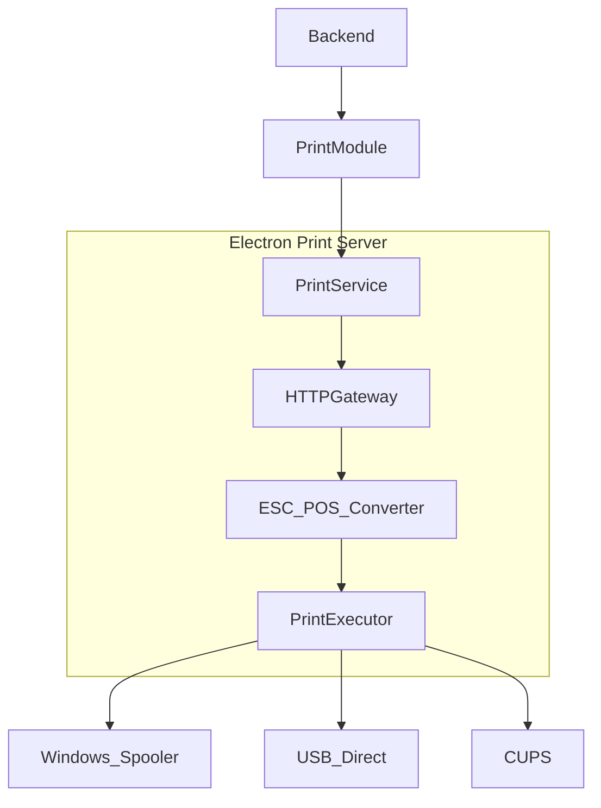

# 🍔 Experimenta AI - Soneca — End-to-end Snack Bar Management Desktop Suite

## 🚀 Overview

The **Experimenta AI - Soneca** project is a full desktop platform for counter-service snack bars, built with Clean Architecture and Clean Code. It delivers order, menu, customer, auth, and fiscal receipt printing flows in a native Electron app backed by a modular Spring Boot stack.

### 🎯 Value Proposition

- **Complete Ops Coverage**: Orders, lobby/kitchen workflow, menu, customers, payments
- **Maven Multi-Module**: Clean Architecture boundaries across independent modules
- **Native Desktop**: Electron for hardware integration and full desktop UX
- **ESC/POS Printing**: Advanced receipt printing with multi-printer support
- **Modern UI**: Angular 17+ standalone components and modern control-flow syntax
- **Enterprise Backend**: Spring Boot 3.2+, layered with ports/use-cases
- **Containerized**: Docker Compose for local/production parity
- **Reliable Data**: MySQL 8.0+ with Liquibase migrations

## 🏗️ System Architecture (Desktop ↔ Backend ↔ DB)

```mermaid
%%{title: "Experimenta AI - Soneca Architecture"}%%
graph TB
    A[Electron Desktop] --> B[Angular 17+ Frontend]
    A --> C[Print Server]
    B --> D[Spring Boot Backend]
    D --> E[MySQL + Liquibase]
    D --> F[Clean Architecture (Use Cases, Ports, Adapters)]
    C --> G[ESC/POS Printers]
```

### Main Flow

```text
1. User opens the Electron app
2. Angular UI loads and calls Spring Boot REST
3. User authenticates (JWT)
4. Orders/menu/customers handled via use-cases
5. Print commands routed to Electron print server (ESC/POS)
6. Data persisted in MySQL with Liquibase versioning
```

### Printing Pipeline



## 🧱 Tech Stack

### Backend (Spring Boot 3.2.12, Java 17)

- Spring Web, Spring Data JPA (Hibernate), Spring Security (JWT)
- Clean Architecture layers (Domain, Application, Infrastructure)
- MySQL 8.0, Liquibase 4.25, HikariCP
- Bean Validation, Global Exception Handler, Lombok, Maven multi-module

### Frontend (Angular 17.3+, TypeScript 5.4+)

- Standalone components, `inject()`, `signal()`, `computed()`
- New control flow (`@if`, `@for`, `@switch`, `@defer`)
- Responsive UI, Chart.js 4.5+, RxJS 7.8

### Desktop (Electron + Node.js)

- IPC between renderer/main, local print server (HTTP)
- ESC/POS command generation, printer discovery, queue management
- Multi-platform support (Windows/Linux/macOS)

### DevOps

- Docker & Docker Compose for local/prod parity
- Maven + Angular CLI builds; hot reload for dev
- Actuator for health/metrics; structured logging

## 📁 Maven Multi-Module Layout

```text
sistema-lanchonete/
├── kernel-compartilhado/      # Shared VOs, exceptions, utils
├── gestao-pedidos/            # Orders (lobby/kitchen)
├── gestao-cardapio/           # Menu/catalog
├── gestao-clientes/           # Customers & history
├── autenticacao/              # AuthN/AuthZ (JWT)
├── impressao-cupom-fiscal/    # ESC/POS receipts
├── sistema-orquestrador/      # Spring Boot app shell
├── frontend/                  # Angular 17+
│   └── electron/              # Electron + print server config
└── docker/                    # Compose definitions
```

## 🎯 Key Functional Areas

- **Orders**: queue management, status lifecycle, payments (PIX/card/cash), shift binding
- **Menu**: CRUD products/categories, pricing, availability, base64 images
- **Customers**: full profile, order history, search & filters
- **Auth**: login, roles (ADMIN/OPERATOR), JWT, guards/interceptors
- **Fiscal Printing**: ESC/POS layout, multi-printer support, Electron IPC
- **Orchestrator**: CORS, datasource configs, Liquibase, SPA fallback

## 🔧 Highlighted Technical Systems

### Clean Architecture

- Dependency rule: Infrastructure → Application → Domain
- Use cases per feature (e.g., `CreateOrderUseCase`, `UpdateStatusUseCase`)
- DTOs + mappers isolate transport from domain

### Angular with Signals

```typescript
readonly orders = signal<Order[]>([]);
readonly pending = computed(() => orders().filter(o => o.status === 'PENDING'));
```

- OnPush change detection, modern template syntax, standalone components

### ESC/POS Printing

- HTTP print server in Electron → ESC/POS converter → platform-specific executor
- Supports Windows spooler, USB direct, Linux CUPS, macOS print

### Security & Validation

- Bean Validation (JSR-303) on DTOs
- Spring Security + JWT with route guards/interceptors on the frontend

## 📊 Database

- Core entities: Orders, Products, Customers, Categories, Users, Work Sessions, Config
- Liquibase changelogs with rollback and seed data support

## 🚀 Build & Run

```bash
# Docker Compose (MySQL + backend)
cd docker
docker-compose up -d

# Maven build (all modules)
mvn clean install

# Run orchestrator
cd sistema-orquestrador
mvn spring-boot:run

# Frontend
cd frontend && npm install && npm run build

# Electron (if applicable)
cd electron && npm install && npm run build:electron
```

## 📈 Impact & Differentiators

- Full Clean Architecture with strict layering
- Modern Angular 17+ syntax (signals, standalone)
- Modular Maven multi-module for scalability
- Advanced ESC/POS printing integrated with Electron
- Desktop-native experience with hardware integration

## 🛠️ Skills Demonstrated

- **Backend**: Java 17, Spring Boot 3.2.12, Clean Architecture, Liquibase, JWT
- **Frontend**: Angular 17.3+, TypeScript 5.4+, signals, standalone components, Chart.js
- **Desktop**: Electron integration, IPC, print server
- **DevOps**: Docker, Maven multi-module, Actuator, structured logging

---
Built with ❤️ following Clean Architecture and Clean Code.
