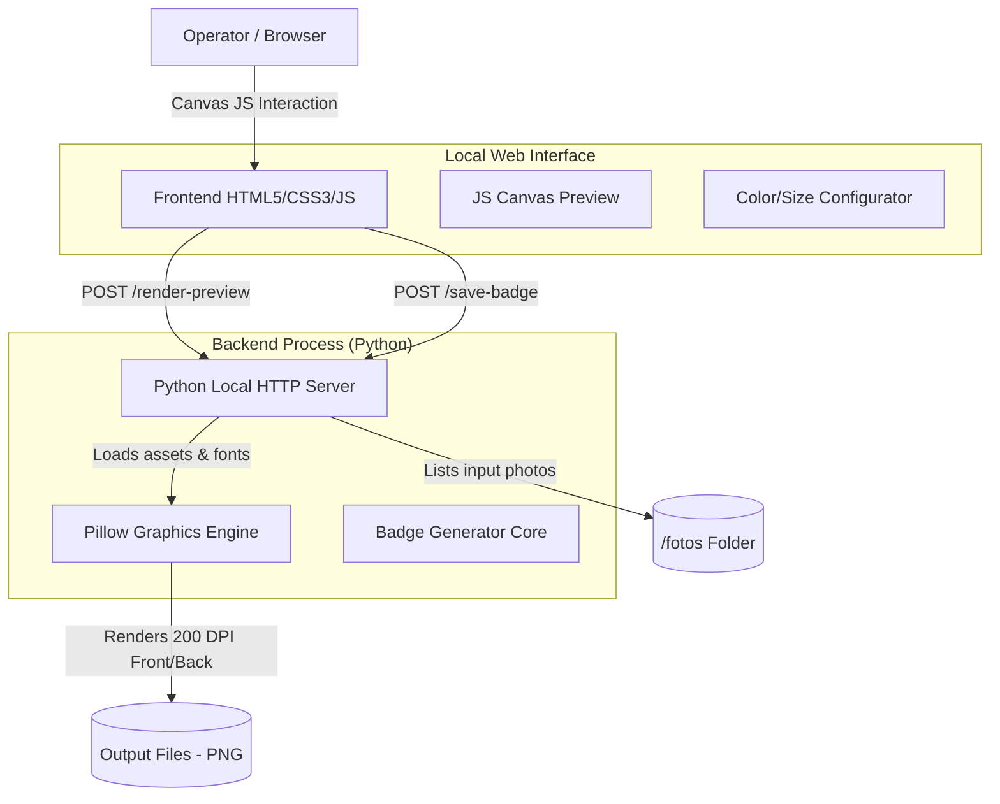
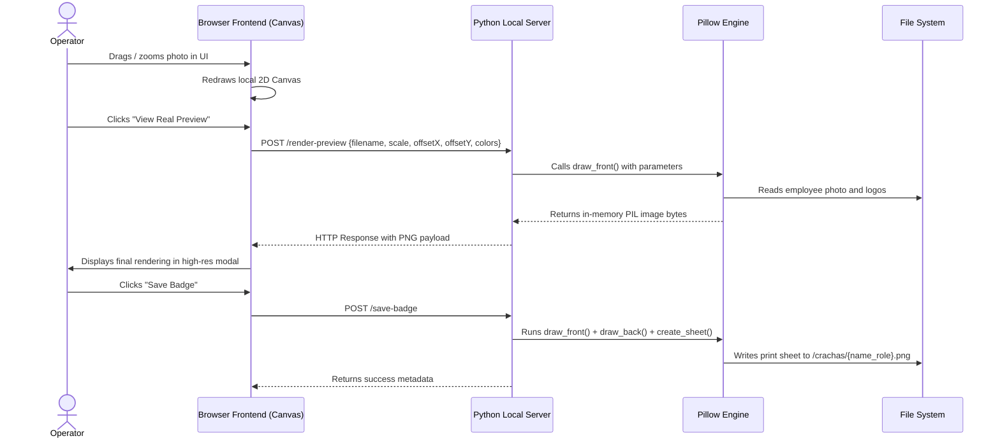

# 🪪 Badge Generator — Automation of Corporate Identity Creation & Printing

## 🚀 Overview

The **Badge Generator** (Gerador de Crachás) is a hybrid desktop application designed to simplify and standardize the process of creating employee identification badges for **Rio Sul Supermercados** and **Grupo RC**. The system merges a robust Python graphics engine (Pillow) with a local interactive web interface (HTML5 Canvas). This enables operators to upload photos, adjust image framing in real time (via dragging and scrolling to zoom), and export print-ready sheets featuring both the front and back of the corporate badge at a crisp 200 DPI.

### 🎯 Value Proposition

- **Intuitive Hybrid Interface**: Runs locally in any browser with interactive photo framing using mouse drag and scroll zoom.
- **Identical Python Rendering**: Javascript Canvas manages real-time positioning in the browser, while Python (Pillow) executes the high-definition print-rendering.
- **Print-Ready Export**: Automatically aligns the front and back side of the badge side-by-side onto a single printable sheet.
- **Easy Distribution**: Bundled into a single, standalone `.exe` using PyInstaller for Windows, allowing deployment without installing Python.

## 🏗️ System Architecture Overview



### Main System Flow

1. The Python backend listens locally on port `7890`. The browser opens the control interface (`preview.html`).
2. The operator selects an employee photo from the `/fotos` directory. The system automatically populates the name and job role parsed from the image filename.
3. The operator adjusts the photo position (dragging to pan, mouse scroll to zoom) directly on the interactive HTML5 Canvas.
4. Clicking "Ver Preview Real" (View Real Preview) posts coordinate data to the Python server, which compiles the vector design and text using high-definition TrueType fonts, returning a sharp PNG preview.
5. Clicking "Salvar Crachá" (Save Badge) generates high-resolution front and back layouts, joins them side-by-side on an output sheet, and writes the file into the `/crachas` folder.

## 🔄 Framing and Rendering Flow



## 🛠️ Tech Stack

### Backend & Rendering

- **Python 3.12** - Scripting and image processing environment.
- **Pillow (PIL)** - Graphics library for raster image editing, vector drawing (hole punches, layout bounds), alpha masks for circular enquadrations, and rendering anti-aliased TrueType fonts.
- **http.server & urllib** - Lightweight native Python HTTP server for managing REST endpoints, avoiding heavy dependencies like Flask or FastAPI for the final bundle.
- **PyInstaller** - Compilation tool used to package the Python script, static assets (logos and fonts), and binary libraries into a single portable 33MB `.exe` for Windows.

### Frontend

- **HTML5 & CSS3 Vanilla** - Modern dark-mode interface, responsive and minimalist.
- **JavaScript (ES6+)** - HTML5 Canvas API for real-time positioning, mouse events (Drag & Drop), wheel scroll zoom, and AJAX backend synchronization.

## 🎯 Technical Features

1. **Physical Aspect Ratio Mapping**: Seamless millimetres-to-pixels translation matching a 200 DPI resolution print profile (a standard 90mm badge width renders exactly at 708px).
2. **Circular Alpha Masking**: Smooth, anti-aliased employee portrait cropping using Pillow's alpha channel blending, preventing jagged edges.
3. **Dynamic Template Recoloring**: Dynamically alters backdrop colors on static template images by re-mapping specific RGB color channels at runtime.
4. **Automatic Font Scaling**: Measures font text metrics (`font.getlength`) inside Pillow to center employee names, dynamically dropping font size if a long name exceeds bounds.
5. **Filename Parsing**: Reads input filenames as structured telemetry. For example, `WESLEY AUGUSTO_DESENVOLVEDOR PLENO.jpg` automatically registers name "WESLEY AUGUSTO" and job title "DESENVOLVEDOR PLENO".

## 🔧 Technical Implementations

### Python Local HTTP Server Handler

```python
# excerpt from preview_server.py
class Handler(BaseHTTPRequestHandler):
    def do_POST(self):
        n = int(self.headers.get('Content-Length', 0))
        body = self.rfile.read(n)
        p = self.path.split('?')[0]

        if p == '/render-preview':
            try:
                data = json.loads(body)
                png_bytes = _generate_badge(data, save=False)
                self._bytes('image/png', png_bytes)
            except Exception as e:
                self.send_error(500, str(e))
                
        elif p == '/save-badge':
            try:
                data = json.loads(body)
                result = _generate_badge(data, save=True)
                self._json(result)
            except Exception as e:
                self.send_error(500, str(e))
```

### Circle Cropping & Offset Calculation in Pillow

Below is a conceptual display of how the photo enquadration parameters configured in the frontend Canvas map directly to Pillow coordinates:

```python
# Concept used in gerar_crachas.py
def draw_front(photo_path, name, cargo, offset_x_frac, offset_y_frac, scale):
    # 1. Initialize empty badge Canvas
    badge = Image.new("RGBA", (708, 1114), colors['bg'])
    draw = ImageDraw.Draw(badge)
    
    # 2. Open and convert employee photo
    with Image.open(photo_path) as photo:
        photo = photo.convert("RGBA")
        
        # Center-crop photo to square
        side = min(photo.size)
        left = (photo.width - side) / 2
        top = (photo.height - side) / 2
        photo_cropped = photo.crop((left, top, left + side, top + side))
        
        # Resize based on scale/zoom slider
        photo_size = int(320 * scale)
        photo_resized = photo_cropped.resize((photo_size, photo_size), Image.Resampling.LANCZOS)
        
        # 3. Create a circular clipping mask
        mask = Image.new("L", (photo_size, photo_size), 0)
        mask_draw = ImageDraw.Draw(mask)
        mask_draw.ellipse((0, 0, photo_size, photo_size), fill=255)
        
        # 4. Apply drag offset coordinates and overlay onto badge
        cx, cy = 363, 416  # Badge center coordinates
        ox = int(offset_x_frac * 320)
        oy = int(offset_y_frac * 320)
        
        paste_x = cx - photo_size // 2 + ox
        paste_y = cy - photo_size // 2 + oy
        
        badge.alpha_composite(photo_resized, (paste_x, paste_y), mask=mask)
        
    return badge
```

## 📊 Technical Differentiators

- **Bundled Executable with Virtual File System**: Leverages `sys._MEIPASS` to extract design templates and TTF fonts to temporary system folders on startup, guaranteeing runtime execution without asset deployment.
- **Template Color Swapping**: Re-maps pixels in static assets to allow instant background styling.
- **Low Footprint**: Consumes under 45MB of RAM and runs instantly on Windows environments.

## 🚀 Final Result

The **Badge Generator** successfully automated the physical deployment of company badges. It replaces complicated workflows in Photoshop or Illustrator with a 3-click local application, guaranteeing layout correctness and professional print outputs.

---

## 📋 Index

- [Core Features](#-core-features)
- [Project Structure](#-project-structure)
- [Execution Guide](#-execution-guide)
- [Executable Compilation](#-executable-compilation)

---

## ✨ Core Features

- **Photo Listing**: Scans and parses metadata from the `/fotos` folder dynamically.
- **Framing Controls**: Drag with the left mouse button to adjust crop and use the scroll wheel to zoom.
- **Color Picker**: Change corporate theme colors on the fly.
- **Combined Layout Sheet**: Stitches front and back sides together on a single canvas with guide lines for easy cropping.

## 📁 Project Structure

```text
gerador-de-cracha/
├── assets/                  # Logos and TrueType fonts (.ttf)
├── fotos/                   # Raw employee input photos
├── crachas/                 # High-resolution output badges (PNG)
├── preview.html             # Local web GUI
├── preview_server.py        # HTTP API and local file server
├── gerar_crachas.py         # Pillow graphic drawing engine
├── criar_exe.bat            # Windows batch script for PyInstaller build
└── requirements.txt         # Dependencies (Pillow)
```

## 🚀 Execution Guide

### 1. File Preparation

Place employee photos in the `/fotos/` directory named exactly as: `FIRSTNAME LASTNAME_JOB TITLE.jpg`.

### 2. Run Python Server

```bash
pip install -r requirements.txt
python preview_server.py
```
Your default browser will launch `http://localhost:7890` automatically.

### 3. Run Precompiled Executable

Double-click `GeradorDeCrachas.exe` in the root folder. It fires the backend server and opens the browser interface.

## 📦 Executable Compilation (Windows)

To package the application into a standalone Windows binary, run the batch script:

```cmd
criar_exe.bat
```
The resulting executable will be created in `/dist/GeradorDeCrachas.exe`. It fully compiles the Pillow library, the local server, and all design assets.
