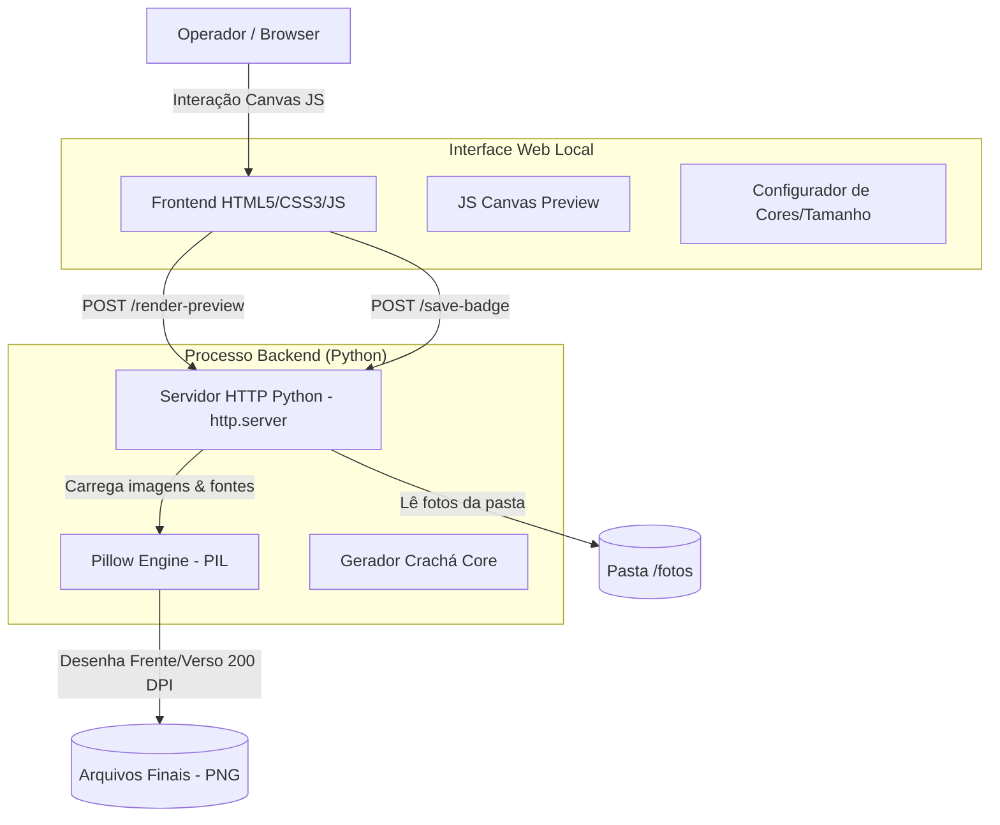
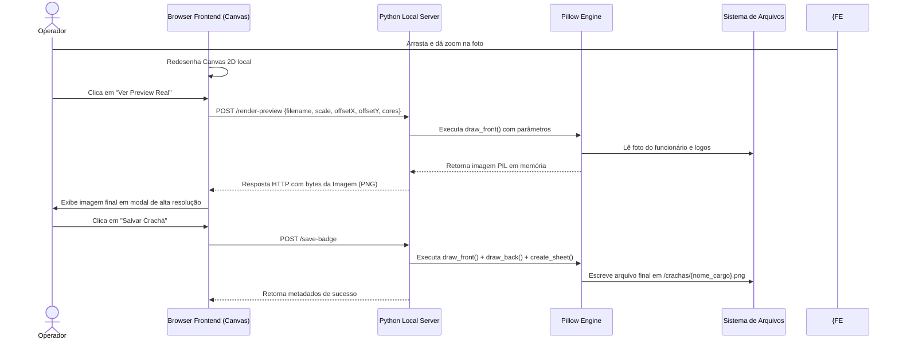

# 🪪 Gerador de Crachás — Automatização de Criação e Impressão de Identidades Corporativas

## 🚀 Visão Geral

O **Gerador de Crachás** é uma aplicação desktop híbrida desenvolvida para simplificar e padronizar o processo de criação de crachás de identificação para funcionários do **Rio Sul Supermercados** e do **Grupo RC**. O sistema une um motor gráfico robusto em Python (Pillow) com uma interface interativa web local (HTML5 Canvas), permitindo aos operadores carregar fotos, ajustar enquadramento em tempo real (arrastar e zoom) e exportar folhas de impressão prontas com frente e verso no tamanho padrão de crachá corporativo a 200 DPI.

### 🎯 Proposta de Valor

- **Interface Híbrida Intuitiva**: Operação local em browser com enquadramento de foto interativo via mouse drag e scroll zoom.
- **Renderização Idêntica em Python**: Prévia no navegador via Canvas JavaScript e renderização em alta definição (DPI para impressão) realizada diretamente pelo backend Python via Pillow.
- **Exportação Pronta para Impressão**: Agrupamento automático de frente e verso em uma única imagem pronta para papel fotográfico.
- **Fácil Distribuição**: Empacotamento completo em um único executável standalone via PyInstaller para Windows, sem necessidade de instalar interpretador Python.

## 🏗️ Arquitetura Geral do Sistema



### Fluxo de Funcionamento

1. O backend Python escuta localmente na porta `7890`. O browser abre a página de controle (`preview.html`).
2. O operador seleciona um funcionário a partir das fotos na pasta `/fotos`. O sistema preenche o nome e cargo deduzidos do nome do arquivo.
3. O operador ajusta a foto (arrastando para posicionar e usando o scroll do mouse para dar zoom) diretamente na prévia visual Canvas.
4. Ao clicar em "Ver Preview Real", o frontend envia os dados de corte para a API Python, que desenha o crachá usando as fontes oficiais e retorna a imagem renderizada em alta qualidade.
5. Ao clicar em "Salvar Crachá", o sistema cria as imagens da Frente e do Verso, junta-as lado a lado em uma folha de impressão e salva na pasta `/crachas` pronta para envio para a impressora.

## 🔄 Fluxo de Edição e Renderização



## 🛠️ Stack Tecnológica

### Backend & Renderização

- **Python 3.12** - Ambiente de script e processamento de imagem.
- **Pillow (PIL)** - Biblioteca gráfica para tratamento de imagem raster, desenho de vetores (furos, caixas de texto), máscaras de transparência para enquadramento circular e escrita de fontes TrueType com antialiasing.
- **http.server & urllib** - Servidor HTTP nativo e enxuto integrado no Python para API REST de controle local, eliminando dependências pesadas como Flask ou FastAPI para o executável final.
- **PyInstaller** - Ferramenta utilizada para compilar o script Python, assets estáticos (logos e fontes) e dependências C em um único arquivo `.exe` portátil de 33MB.

### Frontend

- **HTML5 & CSS3 Vanilla** - Layout em modo escuro com design premium, responsivo e limpo.
- **JavaScript (ES6+)** - Canvas API para simulação em tempo real, manipulação de eventos de mouse (Drag & Drop), roda do mouse (Scroll Zoom) e integração AJAX com o backend.

## 🎯 Funcionalidades Técnicas

1. **Cálculo de Proporções Físicas**: Conversão precisa de milímetros para pixels em resolução de impressão de 200 DPI (crachá de 90mm de largura vira 708px de largura).
2. **Máscara Alfa Circular**: Recorte perfeito e suavizado da foto do funcionário em formato circular utilizando máscara alpha do Pillow, prevenindo bordas serrilhadas.
3. **Template Dinâmico Vetorial**: Desenho de curvas de fundo (Blobs) estilizadas baseadas em equações elípticas ou injeção de template raster com substituição de cores dinâmicas por substituição direta de matriz de cor (Color Remapping).
4. **Alinhamento Automático de Texto**: Medição de strings de texto no Pillow (`font.getlength`) para garantir centralização horizontal e redução automática de fonte caso o nome do funcionário exceda o limite físico do crachá.
5. **Comunicação por Arquivos Locais**: O nome do arquivo da foto serve como entrada de dados estruturados. Exemplo: `WESLEY AUGUSTO_DESENVOLVEDOR PLENO.jpg` define automaticamente o nome "WESLEY AUGUSTO" e o cargo "DESENVOLVEDOR PLENO".

## 🔧 Implementações Técnicas

### Servidor HTTP Local Enxuto (Python)

```python
# excerpt from preview_server.py
class Handler(BaseHTTPRequestHandler):
    def do_POST(self):
        n = int(self.headers.get('Content-Length', 0))
        body = self.rfile.read(n)
        p = self.path.split('?')[0]

        if p == '/render-preview':
            try:
                data = json.loads(body)
                png_bytes = _generate_badge(data, save=False)
                self._bytes('image/png', png_bytes)
            except Exception as e:
                self.send_error(500, str(e))
                
        elif p == '/save-badge':
            try:
                data = json.loads(body)
                result = _generate_badge(data, save=True)
                self._json(result)
            except Exception as e:
                self.send_error(500, str(e))
```

### Recorte e Posicionamento de Foto com Pillow

Abaixo está a representação conceitual de como a foto é posicionada e recortada no backend para corresponder ao ajuste feito no Canvas do browser:

```python
# Conceito usado em gerar_crachas.py
def draw_front(photo_path, name, cargo, offset_x_frac, offset_y_frac, scale):
    # 1. Cria canvas do crachá e inicializa o desenho
    badge = Image.new("RGBA", (708, 1114), colors['bg'])
    draw = ImageDraw.Draw(badge)
    
    # 2. Carrega e redimensiona a foto do funcionário
    with Image.open(photo_path) as photo:
        photo = photo.convert("RGBA")
        
        # Encontra o menor lado para fazer o crop quadrado centralizado
        side = min(photo.size)
        left = (photo.width - side) / 2
        top = (photo.height - side) / 2
        photo_cropped = photo.crop((left, top, left + side, top + side))
        
        # Redimensiona baseado no zoom/escala escolhido
        photo_size = int(320 * scale)
        photo_resized = photo_cropped.resize((photo_size, photo_size), Image.Resampling.LANCZOS)
        
        # 3. Cria uma máscara circular para o recorte
        mask = Image.new("L", (photo_size, photo_size), 0)
        mask_draw = ImageDraw.Draw(mask)
        mask_draw.ellipse((0, 0, photo_size, photo_size), fill=255)
        
        # 4. Calcula offset e cola a foto com a máscara
        cx, cy = 363, 416  # Centro do círculo no crachá
        ox = int(offset_x_frac * 320)
        oy = int(offset_y_frac * 320)
        
        paste_x = cx - photo_size // 2 + ox
        paste_y = cy - photo_size // 2 + oy
        
        badge.alpha_composite(photo_resized, (paste_x, paste_y), mask=mask)
        
    return badge
```

## 📊 Diferenciais Técnicos

- **Compilação com Assets Incorporados**: Uso de `sys._MEIPASS` para extrair fontes e templates do executável temporariamente na execução, garantindo que o programa rode sem dependências externas.
- **Color Remapping de Templates**: Permite alterar dinamicamente cores de elementos em arquivos de imagem estáticos baseados em canais de cor RGB específicos em tempo de execução.
- **Execução Leve**: Consome menos de 45MB de RAM e inicia instantaneamente no Windows.

## 🚀 Resultado Final

O **Gerador de Crachás** automatizou com sucesso a entrega física de crachás corporativos. Ele substitui processos manuais complexos no Photoshop ou CorelDraw por uma ferramenta focada de 3 cliques, com margem de erro zero e qualidade de impressão profissional.

---

## 📋 Índice

- [Funcionalidades Principais](#-funcionalidades-principais)
- [Estrutura do Projeto](#-estrutura-do-projeto)
- [Como Executar](#-como-executar)
- [Build do Executável](#-build-do-executável)

---

## ✨ Funcionalidades Principais

- **Visualização de Fotos**: Carregamento reativo da lista de arquivos da pasta `/fotos`.
- **Ajuste Fino Manual**: Arrasto com botão esquerdo para reposicionar a foto e scroll para zoom.
- **Configuração de Layout**: Alteração interativa de todas as cores do crachá e largura física da folha de impressão.
- **Folha de Impressão Integrada**: Une a frente e o verso com linhas de corte para facilitar a impressão em impressoras comuns ou térmicas.

## 📁 Estrutura do Projeto

```text
gerador-de-cracha/
├── assets/                  # Logos (Rio Sul, Grupo RC) e fontes TTF
├── fotos/                   # Fotos dos funcionários de entrada
├── crachas/                 # Crachás finais gerados em alta resolução
├── preview.html             # Interface web local
├── preview_server.py        # API HTTP e servidor de arquivos local
├── gerar_crachas.py         # Motor gráfico PIL (Gera os PNGs)
├── criar_exe.bat            # Script de compilação PyInstaller
└── requirements.txt         # Dependências (Pillow)
```

## 🚀 Como Executar

### 1. Preparação

Coloque as fotos dos funcionários na pasta `/fotos/` nomeadas no padrão: `NOME DO FUNCIONARIO_CARGO.jpg`.

### 2. Executando via Script Python

```bash
pip install -r requirements.txt
python preview_server.py
```
O navegador abrirá automaticamente em `http://localhost:7890`.

### 3. Executando o Executável Prontificado

Dê dois cliques em `GeradorDeCrachas.exe` na raiz do projeto. Ele iniciará o servidor em background e abrirá a interface no browser de forma nativa.

## 📦 Build do Executável (Windows)

Para compilar o projeto em um executável autônomo, execute o script em lote:

```cmd
criar_exe.bat
```
O executável final será gerado na pasta `/dist/GeradorDeCrachas.exe`. Ele incorpora de forma transparente a biblioteca Pillow, o servidor web, e todos os arquivos da pasta `/assets/`.
