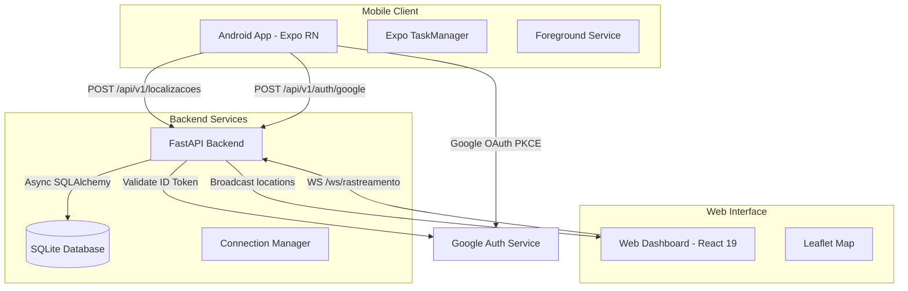
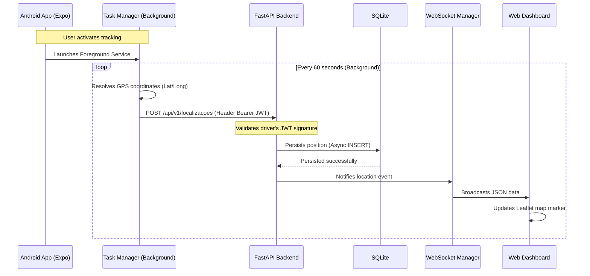
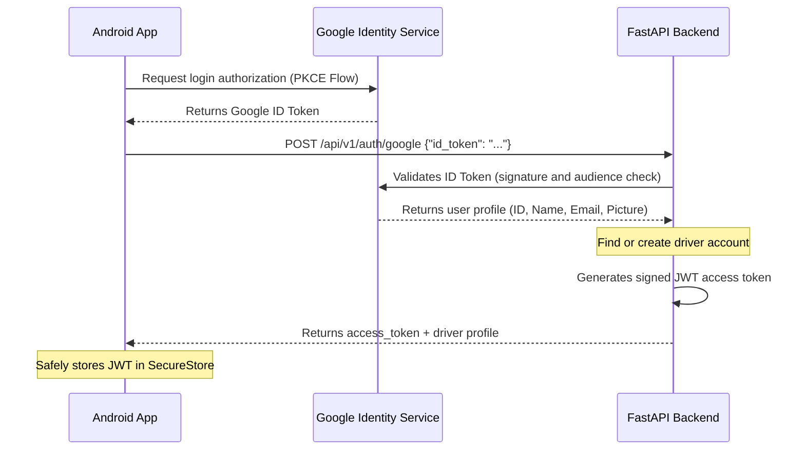

# 🚚 Lat/Long Caminhoneiro — Real-Time GPS Tracking & Web Dashboard

## 🚀 Overview

**Lat/Long Caminhoneiro** is a modern, real-time geographical tracking system tailored for truck drivers and fleet managers. The solution comprises an Android mobile app for background GPS data collection (even when the screen is locked or the app is closed), a highly scalable asynchronous backend API, and a beautiful interactive web dashboard that renders live locations on Leaflet maps.

### 🎯 Value Proposition

- **Robust Background Tracking**: Continuous GPS transmission utilizing Android's native Foreground Service.
- **Real-Time Delivery**: Immediate dashboard status updates powered by WebSockets.
- **Seamless Authentication**: Google OAuth2 social login (leveraging a native PKCE flow on Android).
- **Resource Optimization**: FastAPI + SQLAlchemy Async + SQLite optimized to run smoothly on a 1GB RAM VPS.
- **Interactive Map Visuals**: Custom open-source Leaflet map styling without polling.

## 🏗️ System Architecture Overview



### Main System Flow

1. The truck driver launches the Android application and logs in using their Google account (OAuth2).
2. The driver activates tracking, triggering a persistent Foreground Service with a sticky system notification.
3. Every 60 seconds, the background task queries the device GPS coordinates and sends them via HTTP to the API.
4. The backend validates the driver's JWT, persists the coordinate entry to SQLite, and fires a socket event.
5. The Connection Manager broadcasts this update via WebSocket to all listening web dashboards.
6. The React dashboards immediately redraw the truck driver's custom marker position on the Leaflet map.

## 🔄 Tracking & Real-Time Communication

### Background GPS Submission & WebSocket Broadcasting



## 🔐 Google OAuth2 PKCE & JWT

### Native PKCE Authentication Flow & Backend Token Exchange



## 🛠️ Tech Stack

### Backend

- **Python 3.12** - Asynchronous execution runtime.
- **FastAPI 0.115** - High-performance web framework based on Python type hints and Pydantic v2.
- **SQLAlchemy 2.x (Async)** - Modern ORM utilizing the `aiosqlite` async connection pool.
- **Alembic 1.14** - Database migration manager for schema versioning.
- **PyJWT / python-jose** - Secure JWT creation, signing, and verification.
- **SQLite 3** - Flat file relational database to avoid RAM overhead of traditional databases.

### Mobile

- **React Native + Expo SDK 52** - Universal native app framework.
- **Expo TaskManager & Location** - Operating system hooks for persistent background coordinate polling.
- **Expo SecureStore** - Hardware-encrypted key-value storage for access tokens.
- **Google OAuth2** - Low-friction user onboarding.

### Web (Dashboard)

- **React 19 & TypeScript 5.6** - Modern UI rendering pipeline.
- **Vite 6** - Extremely fast bundler and hot-reloading tool.
- **Leaflet & React-Leaflet** - Open-source interactive map styling (no commercial API fees).
- **Zustand & TanStack Query** - Minimalist client-side state and async query cache.

### DevOps & Infrastructure

- **Nginx** - Reverse proxy, SSL termination (Let's Encrypt), and static file delivery.
- **Systemd** - Long-running process daemon control for the FastAPI instance.
- **Oracle Cloud (Always Free)** - 1GB RAM Ubuntu VPS instance.

## 🎯 Technical Features

1. **Persistent Geolocation**: Leverages Android native OS background listeners to maintain telemetry streams.
2. **Foreground Notification Compliance**: Implements a sticky status bar notification showing active tracking to satisfy OS guidelines.
3. **Reactive Broadcasting**: In-app WebSocket handlers within FastAPI for instant dashboard syncing.
4. **Strict Validation Schemas**: Pydantic schemas parsing incoming coordinates for type-safety and error checking.
5. **Non-blocking Operations**: Async-first code architecture avoiding lockouts during high-frequency DB operations.

## 🔧 Technical Implementations

### FastAPI WebSocket Router

```python
# interfaces/api/v1/routers/websocket_router.py
from fastapi import APIRouter, WebSocket, WebSocketDisconnect

router = APIRouter(tags=["websocket"])

@router.websocket("/ws/rastreamento")
async def websocket_rastreamento(websocket: WebSocket) -> None:
    manager = websocket.app.state.connection_manager
    await manager.conectar(websocket)

    try:
        while True:
            # Keeps the socket connection alive waiting for ping frames
            await websocket.receive_text()
    except WebSocketDisconnect:
        manager.desconectar(websocket)
```

### WebSocket Connection Manager

```python
# interfaces/api/v1/websocket/connection_manager.py
from fastapi import WebSocket
import logging

logger = logging.getLogger(__name__)

class RastreamentoConnectionManager:
    def __init__(self) -> None:
        self._conexoes: list[WebSocket] = []

    async def conectar(self, websocket: WebSocket) -> None:
        await websocket.accept()
        self._conexoes.append(websocket)
        logger.info("Dashboard connected. Total: %d", len(self._conexoes))

    def desconectar(self, websocket: WebSocket) -> None:
        if websocket in self._conexoes:
            self._conexoes.remove(websocket)
        logger.info("Dashboard disconnected. Total: %d", len(self._conexoes))

    async def broadcast_localizacao(self, dados: dict) -> None:
        conexoes_mortas: list[WebSocket] = []
        for conexao in self._conexoes:
            try:
                await conexao.send_json(dados)
            except Exception:
                conexoes_mortas.append(conexao)

        for conexao in conexoes_mortas:
            self.desconectar(conexao)
```

## 📊 Technical Differentiators

- **Zero Memory Overhead**: In a 1GB environment, the total system footprint remains under 400MB of RAM.
- **Leaflet Open Maps**: A solid, cost-free alternative to Google Maps API billing.
- **Expo SDK 52 TaskManager**: Resistant to aggressive OS power saving routines (Doze Mode).

## 🚀 Final Result

The **Lat/Long Caminhoneiro** system provides fleet owners and drivers with a highly optimized, battery-friendly GPS tracker and dashboard, running continuously without expensive database licensing or infrastructure costs.

---

## 📋 Index

- [About the Project](#-about-the-project)
- [Features](#-features)
- [Technologies](#-technologies)
- [Project Structure](#-project-structure)
- [Prerequisites](#-prerequisites)
- [Setup & Execution](#-setup--execution)
- [Deployment](#-deployment)
- [Contributing](#-contributing)

---

## 🎯 About the Project

This system was created to support small-to-medium logistics operations that need tracking tools for delivery logistics without dedicating budget to specialized hardware devices or expensive map APIs.

## ✨ Features

- **OAuth2 Login**: Secure, social onboarding.
- **Background Dispatch**: Passive coordinate polling on Android.
- **Web Dashboard**: Modern maps visualizer.
- **Velocity Tracker**: Native calculation of speed based on GPS updates.

## 🛠️ Technologies

### Backend
- FastAPI
- SQLAlchemy + aiosqlite
- Pydantic v2
- Alembic

### Frontend Web
- React 19
- Vite 6
- Leaflet Maps

### Mobile
- Expo (React Native)
- Expo Location + TaskManager

## 📁 Project Structure

```text
lat-long-caminhoneiro/
├── backend/            # FastAPI API & migrations
├── web/                # React SPA (Dashboard)
├── mobile/             # Android Expo App
├── infra/              # Configuration files (nginx, systemd)
└── PLANNING.md         # Project planning index
```

## 📦 Prerequisites

- Python 3.12 or higher
- Node.js 22 LTS or higher
- Expo Go app installed on your phone (for dev)
- SQLite installed locally

## 🚀 Setup & Execution

### 1. Run Backend

```bash
cd backend
python -m venv .venv
source .venv/bin/activate  # Windows: .venv\Scripts\activate
pip install poetry
poetry install
cp .env.example .env       # set your keys
alembic upgrade head       # run migrations
uvicorn src.app.main:app --reload
```

### 2. Run Dashboard

```bash
cd web
npm install
npm run dev
```
Open `http://localhost:5173`.

### 3. Run Mobile App

```bash
cd mobile
npm install
npx expo start
```
Scan the QR Code using Expo Go on Android.

## 🚢 Deployment

Production deployment on Oracle Cloud utilizes:
1. Nginx proxy routing and SSL certificate.
2. Systemd monitoring.
3. React compiled assets hosted on `/var/www/`.

Deployment scripts are situated in `infra/scripts/deploy.sh`.

## 🤝 Contributing

Contributions regarding battery optimization or map clustering are welcome. Read developer guidelines in `regras-*.md`.

## 📄 License

[MIT License - Wesley Augusto]
