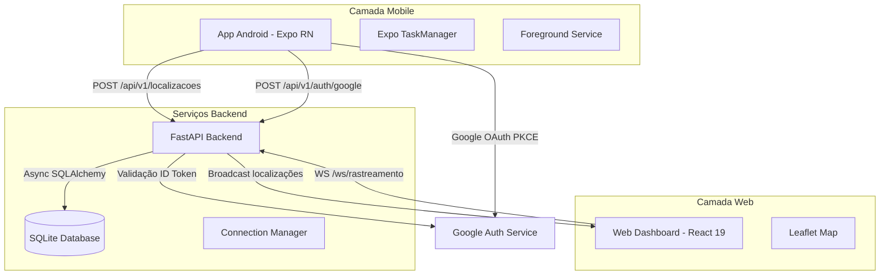
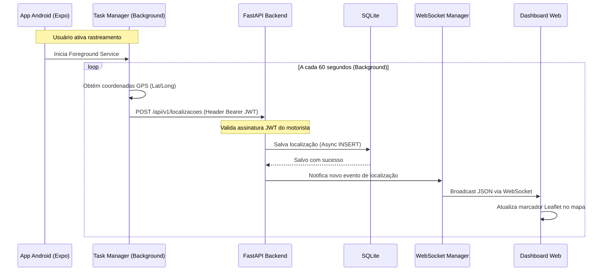
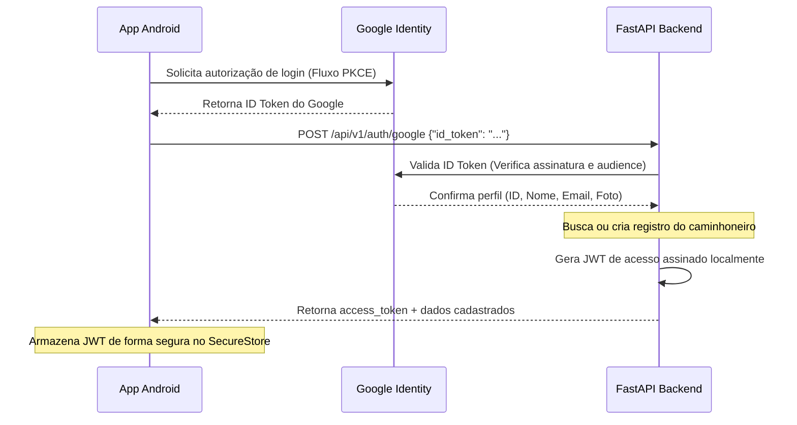

# 🚚 Lat/Long Caminhoneiro — Rastreamento GPS e Dashboard em Tempo Real

## 🚀 Visão Geral

O **Lat/Long Caminhoneiro** é um sistema moderno de rastreamento geográfico em tempo real, projetado especificamente para caminhoneiros e gestores de frota. A solução é composta por um aplicativo mobile Android para coleta de posições via GPS (mesmo com a tela fechada/em segundo plano), uma API backend assíncrona escalável e um dashboard web interativo para monitoramento em tempo real sobre mapas Leaflet.

### 🎯 Proposta de Valor

- **Rastreamento em Background Robusto**: Coleta contínua de GPS via Foreground Service no Android.
- **Comunicação em Tempo Real**: Atualizações instantâneas no dashboard via WebSocket.
- **Autenticação Descomplicada**: Login social com Google OAuth2 (via fluxo PKCE nativo no celular).
- **Leveza Extrema**: Backend FastAPI + SQLAlchemy Async + SQLite otimizados para rodar estavelmente em VPS de 1GB de RAM.
- **Visualização Interativa**: Mapa interativo com atualização em tempo real sem polling.

## 🏗️ Arquitetura Geral do Sistema



### Fluxo Principal do Sistema

1. O motorista inicia o aplicativo Android e faz login utilizando sua conta Google (OAuth2).
2. O motorista ativa o rastreamento, o que inicia um Foreground Service persistente com notificação no celular.
3. A cada 60 segundos, a task de background obtém a posição do GPS e a envia via HTTP para o backend.
4. A API backend valida o token JWT do motorista, salva a posição no SQLite e envia um sinal ao Connection Manager.
5. O Connection Manager realiza o broadcast de atualização via WebSocket para todos os dashboards conectados.
6. Os dashboards Web renderizam instantaneamente o ícone do caminhoneiro se movendo no mapa Leaflet.

## 🔄 Fluxo de Rastreamento e Comunicação

### Envio de GPS em Background e Broadcast WebSocket



## 🔐 Autenticação Google OAuth2 e JWT

### Fluxo de Autenticação PKCE Nativo e API Exchange



## 🛠️ Stack Tecnológica

### Backend

- **Python 3.12** - Ambiente robusto e assíncrono.
- **FastAPI 0.115** - Web framework moderno, rápido, baseado em type hints e Pydantic v2.
- **SQLAlchemy 2.x (Async)** - ORM para persistência utilizando o driver assíncrono `aiosqlite`.
- **Alembic 1.14** - Controle versionado de schemas e migrations do banco de dados.
- **PyJWT / python-jose** - Geração e validação de tokens JWT.
- **SQLite 3** - Banco de dados em arquivo local, eliminando consumo extra de RAM da VPS.

### Mobile

- **React Native + Expo SDK 52** - Framework cross-platform.
- **Expo TaskManager & Location** - Mapeamento e monitoramento de geolocalização nativa em segundo plano.
- **Expo SecureStore** - Armazenamento criptografado do JWT de acesso.
- **Google OAuth2** - Integração social simplificada.

### Web (Dashboard)

- **React 19 & TypeScript 5.6** - Camada SPA estática de alta performance.
- **Vite 6** - Ferramenta ultra-rápida de build e hot module replacement.
- **Leaflet & React-Leaflet** - Biblioteca de mapas interativos open-source (sem custos de API).
- **Zustand & TanStack Query** - Gerenciamento de estado leve e cache de requests.

### DevOps & Infraestrutura

- **Nginx** - Proxy reverso, terminação SSL (Let's Encrypt) e servidor de assets estáticos do frontend.
- **Systemd** - Orquestração e execução contínua do backend em segundo plano.
- **Oracle Cloud (Always Free)** - Instância de 1GB RAM executando Ubuntu.

## 🎯 Funcionalidades Técnicas

1. **Rastreamento em Background**: Uso de Background Tasks integradas ao sistema operacional Android para não interromper a transmissão de GPS.
2. **Foreground Service Persistente**: Notificação ativa indicando que o aplicativo está enviando a localização, garantindo conformidade com regras do Android.
3. **Broadcasting Real-time**: Servidor de WebSockets integrado ao FastAPI para notificação reativa de múltiplos dashboards.
4. **Data Mapper e Segurança**: Validação estrita via Pydantic dos dados de telemetria recebidos.
5. **Arquitetura Async Nativa**: Uso extensivo de async/await no Python para otimização de I/O em banco de dados SQLite concorrente.

## 🔧 Implementações Técnicas

### Conexão WebSocket no Backend (FastAPI)

```python
# interfaces/api/v1/routers/websocket_router.py
from fastapi import APIRouter, WebSocket, WebSocketDisconnect

router = APIRouter(tags=["websocket"])

@router.websocket("/ws/rastreamento")
async def websocket_rastreamento(websocket: WebSocket) -> None:
    manager = websocket.app.state.connection_manager
    await manager.conectar(websocket)

    try:
        while True:
            # Mantém a conexão viva aguardando mensagens de ping
            await websocket.receive_text()
    except WebSocketDisconnect:
        manager.desconectar(websocket)
```

### Connection Manager de WebSockets

```python
# interfaces/api/v1/websocket/connection_manager.py
from fastapi import WebSocket
import logging

logger = logging.getLogger(__name__)

class RastreamentoConnectionManager:
    def __init__(self) -> None:
        self._conexoes: list[WebSocket] = []

    async def conectar(self, websocket: WebSocket) -> None:
        await websocket.accept()
        self._conexoes.append(websocket)
        logger.info("Dashboard conectado. Total: %d", len(self._conexoes))

    def desconectar(self, websocket: WebSocket) -> None:
        if websocket in self._conexoes:
            self._conexoes.remove(websocket)
        logger.info("Dashboard desconectado. Total: %d", len(self._conexoes))

    async def broadcast_localizacao(self, dados: dict) -> None:
        conexoes_mortas: list[WebSocket] = []
        for conexao in self._conexoes:
            try:
                await conexao.send_json(dados)
            except Exception:
                conexoes_mortas.append(conexao)

        for conexao in conexoes_mortas:
            self.desconectar(conexao)
```

## 📊 Diferenciais Técnicos

- **Arquitetura Zero Memory Overhead**: Em uma VPS de 1GB, o sistema operacional e serviços consomem menos de 400MB de RAM.
- **Leaflet Open Maps**: Alternativa robusta e gratuita ao Google Maps API.
- **Expo SDK 52 TaskManager**: Implementação de tarefas persistentes que resistem a agressões do gerenciador de energia do Android (DOZE mode).

## 🚀 Resultado Final

O sistema **Lat/Long Caminhoneiro** atende de forma escalável e confiável os motoristas e gestores, entregando rastreamento contínuo em segundo plano e mapas interativos reativos, mantendo o consumo de recursos computacionais próximo a zero.

---

## 📋 Índice

- [Sobre o Projeto](#-sobre-o-projeto)
- [Funcionalidades](#-funcionalidades)
- [Tecnologias](#-tecnologias)
- [Estrutura do Projeto](#-estrutura-do-projeto)
- [Pré-requisitos](#-pré-requisitos)
- [Instalação e Execução](#-instalação-e-execução)
- [Deploy](#-deploy)
- [Contribuindo](#-contribuindo)

---

## 🎯 Sobre o Projeto

O Lat/Long Caminhoneiro foi construído para resolver a necessidade de frotas de médio porte que precisam acompanhar caminhoneiros em trânsito sem incorrer em custos pesados com hardware dedicado de rastreamento ou faturas exorbitantes de APIs de mapas comerciais.

## ✨ Funcionalidades

- **Autenticação Segura**: Fluxo nativo de Login com Google.
- **Rastreamento Background**: Monitoramento de geolocalização com o celular no bolso.
- **Dashboard Web**: Mapa interativo mostrando todos os motoristas on-line.
- **Telemetria de Velocidade**: Cálculo instantâneo da velocidade média obtido diretamente do sensor GPS do celular.

## 🛠️ Tecnologias

### Backend
- FastAPI
- SQLAlchemy + aiosqlite
- Pydantic v2
- Alembic

### Frontend Web
- React 19
- Vite 6
- Leaflet Maps

### Mobile
- Expo (React Native)
- Expo Location + TaskManager

## 📁 Estrutura do Projeto

```text
lat-long-caminhoneiro/
├── backend/            # API FastAPI & migrations
├── web/                # SPA React (Dashboard)
├── mobile/             # Aplicativo Android (Expo)
├── infra/              # Arquivos nginx.conf e systemd
└── PLANNING.md         # Documento de planejamento do projeto
```

## 📦 Pré-requisitos

- Python 3.12 ou superior
- Node.js 22 LTS ou superior
- Expo Go instalado no celular (para testes)
- SQLite instalado (para conferência direta)

## 🚀 Instalação e Execução

### 1. Inicializando o Backend

```bash
cd backend
python -m venv .venv
source .venv/bin/activate  # no Windows: .venv\Scripts\activate
pip install poetry
poetry install
cp .env.example .env       # preencha com suas chaves
alembic upgrade head       # executa as migrations
uvicorn src.app.main:app --reload
```

### 2. Inicializando o Dashboard Web

```bash
cd web
npm install
npm run dev
```
Acesse `http://localhost:5173`.

### 3. Executando o Aplicativo Mobile

```bash
cd mobile
npm install
npx expo start
```
Escaneie o QR Code usando o aplicativo Expo Go no celular Android.

## 🚢 Deploy

O deploy detalhado na Oracle Cloud (VPS Ubuntu Always Free) utiliza:
1. Nginx como roteador principal do tráfego e SSL.
2. Systemd para manter a API Python rodando continuamente como serviço.
3. Build estático do React exportado para `/var/www/`.

Os scripts de deploy estão localizados na pasta `infra/scripts/deploy.sh`.

## 🤝 Contribuindo

Contribuições de melhoria de bateria do app mobile ou filtros no mapa são bem-vindas. Siga os guias de desenvolvimento listados nos arquivos `regras-*.md`.

## 📄 Licença

[Licença MIT - Wesley Augusto]
