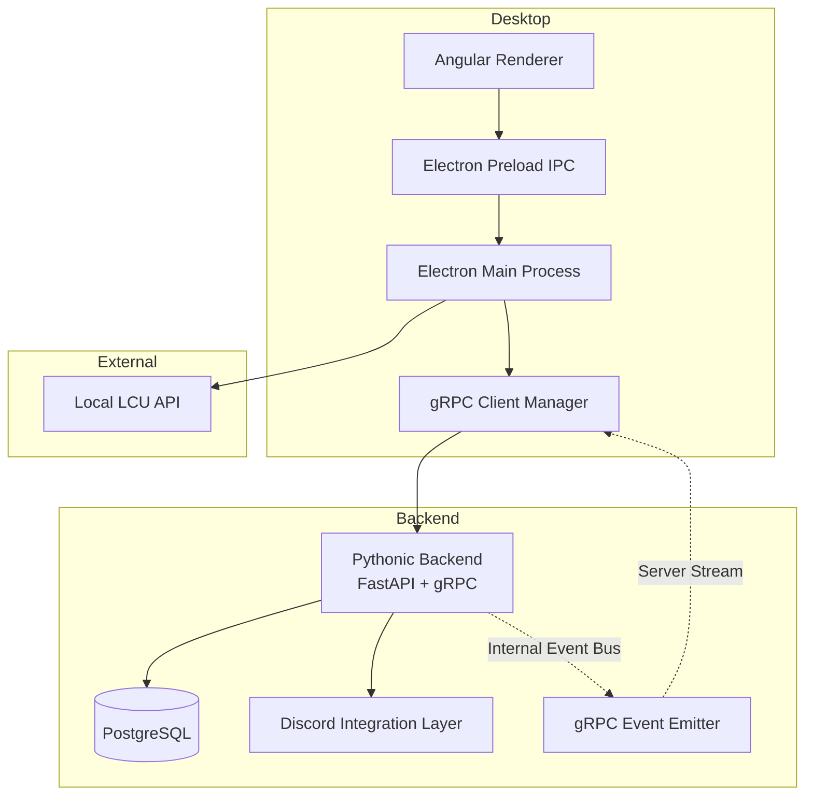
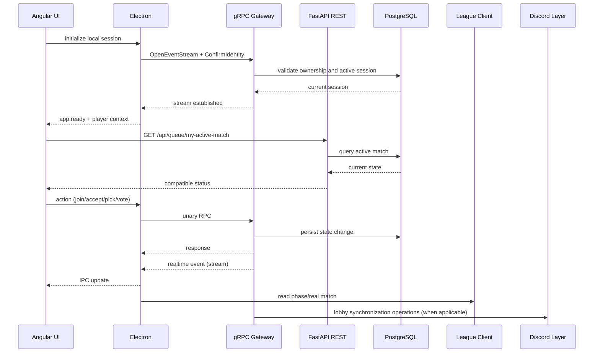
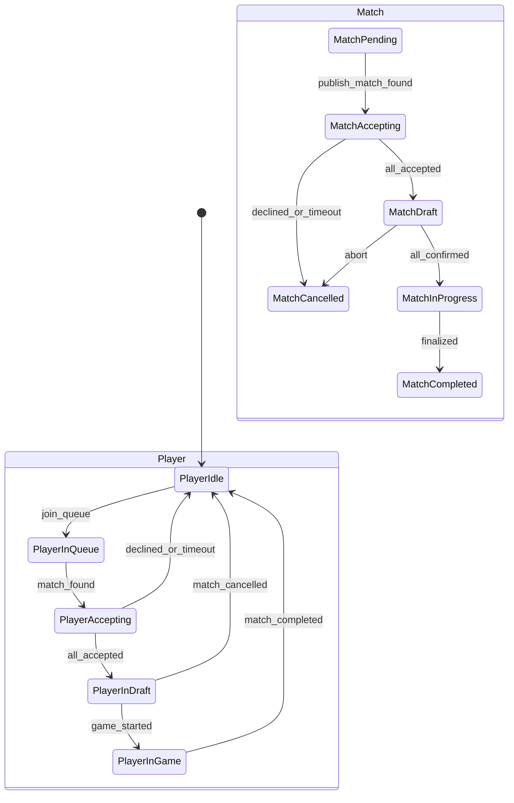
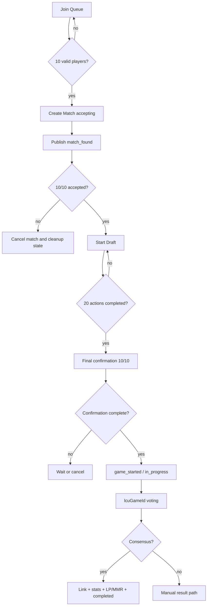
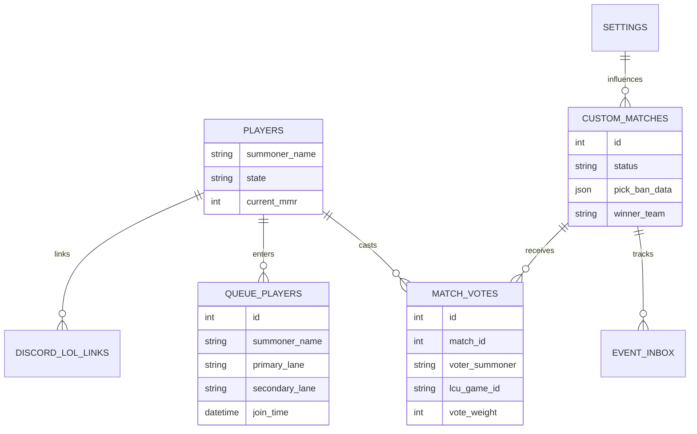
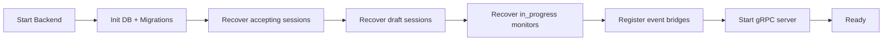
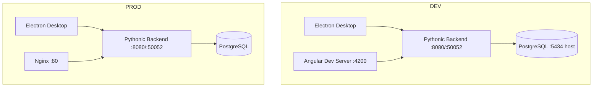

# 🎮 LOL Fazenda Inhouse - Advanced Matchmaking Platform

## 🚀 Overview

**LOL Fazenda Inhouse** is a complete and innovative custom matchmaking solution for League of Legends, designed for competitive operation with technical consistency and product maturity.

This platform combines a desktop architecture with a centralized backend to deliver:

- queue orchestration and balanced match formation
- competitive draft with strict rules and strong synchronization
- desktop integration with League Client (LCU) through Electron
- centralized state coordination in the Pythonic backend
- post-game flow with real-match linking consensus

### 🎯 Value Proposition

- **Predictable operations**: end-to-end flow with clear state-transition rules
- **Competitive integrity**: ownership controls, idempotency, and result consensus
- **Scalable evolution**: stable contracts for frontend and desktop, with a consolidated gRPC migration path

This documentation replaces the old Java/Spring/Redis narrative and reflects the current architecture:

- Backend: Python 3.12 + FastAPI + gRPC
- Frontend: Angular 20
- Desktop: Electron 28
- Persistence: PostgreSQL + Alembic

---

## 🎯 1. Goals and Value

### 💼 1.1 Business Goal

Deliver a competitive inhouse experience with operational predictability and match integrity:

- reduce friction in custom match organization
- ensure minimum balancing by skill and lanes
- standardize queue -> draft -> game -> result transition
- provide decision traceability (events, votes, idempotency)

### 🔧 1.2 Technical Goal

Maintain a coordinating backend that acts as the source of truth for state, with:

- stable contracts for Electron and Angular
- session-based ownership rules
- recovery capability after restart/disconnect
- gRPC as the canonical desktop channel

### 📌 1.3 Scope of This Version

Includes:

- target architecture and layer responsibilities
- end-to-end functional flow
- relevant gRPC and HTTP contracts
- domain model, states, and persistence
- operation, observability, security, and risks

Does not include:

- frontend UX manual
- contribution workflow guide
- infrastructure details outside the current repository

---

## 🏗️ 2. Overall Solution Architecture

### 🧭 2.1 Architectural Principles

- Angular must not access LCU directly
- Electron is the trusted edge for local identity and LoL client integration
- backend centralizes business rules, state, and persistence
- gRPC is the primary real-time channel for desktop
- REST remains for compatibility contracts and queries

### ⚠️ 2.2 Key Differences vs Legacy

| Topic | Legacy | Current |
| --- | --- | --- |
| Backend | Java Spring Boot | Python FastAPI |
| Desktop realtime | WebSocket-dominant | gRPC-dominant |
| Distributed transient state | Redis | In-memory state + DB |
| Primary DB | MySQL | PostgreSQL |
| Schema migrations | Liquibase | Alembic |

---

## 🔄 3. Communication and Synchronization Architecture

### 📡 3.1 Official Communication Channels

- UI -> Electron: IPC
- Electron -> Backend: gRPC (actions + stream)
- UI -> Backend: HTTP for reads/compatibility
- Backend -> DB: SQLAlchemy async

### 📨 3.2 gRPC Stream Event Contract

Logical envelope:

- event_type
- timestamp_ms
- message_id
- payload_json
- optional match_id

Goal:

- keep payloads compatible with what frontend already expects
- reduce mapping divergence across execution modes

---

## 🧩 4. Components and Responsibilities

### 🐍 4.1 Pythonic Backend (Layers)

| Layer | Responsibility |
| --- | --- |
| `domain` | entities, enums, repository contracts |
| `application` | use cases: queue, matchmaking, draft, vote, finalization |
| `infrastructure` | database, repositories, external integrations, tasks |
| `interfaces` | REST routers, gRPC servicers, event bridge |

### 🖥️ 4.2 Electron

| Component | Responsibility |
| --- | --- |
| grpc manager | connection, reconnection, unary calls |
| event stream handler | subscribe and IPC fan-out |
| LCU bridge | local LoL client state reading |
| session coordination | custom session id and identity confirmation |

### 🌐 4.3 Angular

| Area | Responsibility |
| --- | --- |
| queue view | join/leave queue and status visibility |
| match found modal | accept/decline and progress |
| draft view | picks/bans/final confirmation |
| in-game/post-game | match progress and voting |

---

## 🧠 5. Canonical Domain Model

### 👤 5.1 Player Identity

Canonical interoperability identifier:

- `summoner_name = gameName#tagLine`

Accepted compatibility aliases:

- `displayName`
- historical `summonerName`
- `riotId` in legacy payloads

Mandatory rule:

- normalize casing and whitespace before ownership comparisons

### 🗂️ 5.2 Core Entities

- Player
- QueuePlayer
- Match (`custom_matches`)
- MatchVote
- IdempotencyRequest
- Setting
- DiscordConfig
- DiscordLolLink

### 🔋 5.3 Player States

| State | Meaning |
| --- | --- |
| `idle` | ready to join queue |
| `in_queue` | currently queued |
| `accepting_match` | in match-found/accept phase |
| `in_draft` | in draft/final confirmation |
| `in_game` | game started |
| `disconnected` | requires reconciliation |

### 🎲 5.4 Match States

| State | Meaning |
| --- | --- |
| `pending` | created but not yet published |
| `accepting` | acceptance phase |
| `draft` | pick/ban and final confirmation |
| `in_progress` | game running |
| `completed` | finished with final result |
| `cancelled` | cancelled by decline/timeout/error |

### 🧾 5.5 State Diagram

---

## 🎮 6. End-to-End Functional Flow

### 🚪 6.1 Initialization and Identity

1. Electron starts and generates/restores `customSessionId`.
2. Electron opens gRPC stream (`OpenEventStream`).
3. Electron confirms identity (`ConfirmIdentity`).
4. UI receives player context through IPC.
5. UI calls `GET /api/queue/my-active-match` for restoration.

Rules:

- backend must recover active state without relying only on memory
- session mismatch must block sensitive actions

### 🧲 6.2 Queue Entry

1. UI requests join with `primaryLane` + `secondaryLane`.
2. Backend validates:
   - existing player
   - compatible current state (`idle`)
   - duplicate queue entry
   - optional Discord eligibility requirements (when enabled)
3. Creates active `queue_players` row.
4. Updates `Player.state = in_queue`.
5. Publishes `queue_update`.

### ⚙️ 6.3 Matchmaking Trigger

Target rule:

- when 10 eligible players exist, select a closed batch and form a match

Important signals:

- FIFO selection for operational fairness
- do not mix players in inconsistent states
- abort creation if lane assignment becomes invalid

### ⚖️ 6.4 Team Balancing

Current approach (high level):

- sort candidates by strength metric (win rate/MMR according to implementation)
- distribute using snake pattern to reduce imbalance
- enforce lane composition per team: `top`, `jungle`, `mid`, `adc`, `support`

Example distribution pattern:

- B, R, R, B, B, R, R, B, B, R

### ✅ 6.5 Match Found and Acceptance

1. Backend creates acceptance session with timeout (default 30s).
2. Publishes `match_found` to all 10 players.
3. For each acceptance, publishes `acceptance_progress`.
4. If decline/timeout occurs, match is cancelled and state is cleaned.
5. If all accept, transition to draft.

Rules:

- duplicate acceptance must be idempotent
- bots/special users may auto-accept by configuration

### 🛡️ 6.6 Competitive Draft

1. Draft starts after 10/10 acceptance.
2. UI consumes (`draft_update`, `draft_updated`) + snapshot endpoint.
3. After 20 actions, final confirmation for all 10 players opens.
4. 10/10 confirmation -> `game_started`.

#### 📋 6.6.1 Canonical Draft Order

| Index | Team | Action | Phase |
| --- | --- | --- | --- |
| 0 | blue | ban | ban_phase_1 |
| 1 | red | ban | ban_phase_1 |
| 2 | blue | ban | ban_phase_1 |
| 3 | red | ban | ban_phase_1 |
| 4 | blue | ban | ban_phase_1 |
| 5 | red | ban | ban_phase_1 |
| 6 | blue | pick | pick_phase_1 |
| 7 | red | pick | pick_phase_1 |
| 8 | red | pick | pick_phase_1 |
| 9 | blue | pick | pick_phase_1 |
| 10 | blue | pick | pick_phase_1 |
| 11 | red | pick | pick_phase_1 |
| 12 | red | ban | ban_phase_2 |
| 13 | blue | ban | ban_phase_2 |
| 14 | red | ban | ban_phase_2 |
| 15 | blue | ban | ban_phase_2 |
| 16 | red | pick | pick_phase_2 |
| 17 | blue | pick | pick_phase_2 |
| 18 | blue | pick | pick_phase_2 |
| 19 | red | pick | pick_phase_2 |

#### ⏱️ 6.6.2 Timer

Target functional rule:

- 45 seconds per draft action

Attention point:

- keep consistency across config, services, REST/gRPC payloads, and UI

### 🎬 6.7 Game Start

1. Final confirmation completes.
2. Backend sets `Match.status = in_progress`.
3. Players transition to `in_game`.
4. Backend publishes `game_started`.

### 🏁 6.8 Post-Game, Linking Vote, and Finalization

1. Backend opens `lcuGameId` vote session for consensus.
2. Players vote for the corresponding real match.
3. With consensus, backend links real match, calculates final result, and persists stats.
4. Without consensus, manual result path (`VoteWinner`/`ReportResult`) is used with the same finalization pipeline.

---

## 📜 7. gRPC Contracts (Canonical Desktop Channel)

### 🧱 7.1 Main Services

| Service | Method | Purpose |
| --- | --- | --- |
| SessionService | OpenEventStream | single event stream |
| SessionService | Heartbeat | keepalive and session health |
| SessionService | ConfirmIdentity | session/player ownership |
| SessionService | GetActiveSessions | operational visibility |
| QueueService | JoinQueue / LeaveQueue | queue operations |
| MatchService | AcceptMatch / DeclineMatch | acceptance phase |
| MatchService | CancelMatch | match cancellation |
| MatchService | VoteGameId | post-game link consensus |
| DraftService | PickChampion / BanChampion | draft actions |
| DraftService | ConfirmDraft | final confirmation |
| GameService | VoteWinner / ReportResult | fallback/manual path |
| DiscordService | Status / users / move ops | lobby synchronization |
| LcuProxyService | SendLcuResponse | LCU request response path for desktop |

### 🧪 7.2 Legacy/Unimplemented Methods

Still outside the main path:

- `DraftService.SelectLane`
- `GameService.Surrender`
- `LcuProxyService.Request`

### 📣 7.3 Most Relevant Stream Events

- `queue_update`
- `match_found`
- `acceptance_progress`
- `match_cancelled`
- `draft_started`
- `draft_update`
- `draft_updated`
- `draft_confirmation_update`
- `game_started`
- `game_in_progress`
- `game_ended`
- `match_vote_progress`
- `match_vote_update`
- `match_linked`

Routing rule:

- when payload does not explicitly include recipients, backend resolves recipients by `match_id`

---

## 🔌 8. Mandatory HTTP Contracts for Compatibility

Base prefix: `/api`

Critical headers:

- `X-Summoner-Name`
- `X-Custom-Session-Id`
- `Idempotency-Key` (critical actions)

### 📥 8.1 Queue API

| Endpoint | Purpose |
| --- | --- |
| `GET /queue/status` | aggregated queue status |
| `POST /queue/join` | join queue |
| `POST /queue/leave` | leave queue |
| `POST /queue/refresh` | compatibility refresh |
| `POST /queue/force-sync` | forced synchronization |
| `POST /queue/add-bot` | testing support |
| `GET /queue/my-active-match` | session state restoration |

### 🆚 8.2 Match API

| Endpoint | Purpose |
| --- | --- |
| `POST /match/accept` | accept match |
| `POST /match/decline` | decline match |
| `POST /match/draft-action` | pick/ban via compatibility path |
| `GET /match/{match_id}/draft-session` | full draft snapshot |
| `POST /match/{match_id}/confirm-final-draft` | final confirmation |
| `GET /match/{match_id}/confirmation-status` | confirmation progress |
| `POST /match/{match_id}/vote` | `lcuGameId` vote |
| `GET /match/{match_id}/votes` | vote state |
| `POST /match/{match_id}/cancel` or `DELETE /match/{match_id}/cancel` | cancellation |

### 🧬 8.3 Legacy Draft API

| Endpoint | Expected status |
| --- | --- |
| `POST /draft/{match_id}/changePick` | compatibility path |
| `POST /draft/{match_id}/confirm-lane` | legacy, often 501 |
| `POST /draft/{match_id}/swap-request` | legacy, often 501 |
| `POST /draft/{match_id}/swap-accept` | legacy, often 501 |

### 🛠️ 8.4 Admin and Config

| Endpoint | Purpose |
| --- | --- |
| `GET /admin/special-user/{summoner}/status` | query special role |
| `GET /admin/special-user/{summoner}/config` | read config |
| `PUT /admin/special-user/{summoner}/config` | update config |
| `GET /config/status` | config health |
| `GET /config/settings` | global settings |
| `PUT /config/setting/{key}` | change config |
| `DELETE /config/setting/{key}` | remove config |

---

## 🛡️ 9. Idempotency, Ownership, and Integrity

### ♻️ 9.1 Minimum Idempotent Scopes

- queue.join
- queue.leave
- match.accept
- match.decline
- draft.action
- draft.changePick
- draft.confirm
- recommendation: make game-id vote idempotent too

### ✅ 9.2 Expected Guarantees

- retries do not duplicate side effects
- same key + same payload returns consistent result
- same key + different payload is rejected

### 🆔 9.3 Session-Based Ownership

Goal:

- prevent user A from executing actions in user B session/match

Mechanism:

- correlation between `X-Summoner-Name` + `X-Custom-Session-Id`
- validation at entry points (REST/gRPC)
- recipient-aware event routing

---

## 🗄️ 10. Persistence and Data Structure

### 📚 10.1 Most Relevant Persisted Entities

| Table | Purpose |
| --- | --- |
| `players` | player registry and state |
| `queue_players` | active queue and entry metadata |
| `custom_matches` | full match lifecycle |
| `match_votes` | linking votes and consensus |
| `idempotency_requests` | operation deduplication |
| `settings` | dynamic behavior |
| `discord_config` | integration settings |
| `discord_lol_links` | Discord <-> LoL linking |
| `event_inbox` | resilience/event support |

### 🎯 10.2 Strategic Field

`pick_ban_data` in `custom_matches`:

- canonical serialized snapshot of draft and game state
- basis for UI restoration and post-restart reconciliation

### 🔗 10.3 High-Level Relationships

---

## 🌍 11. External Integrations

### 🎯 11.1 LCU (League Client)

Usage:

- local player identity discovery
- game-state reading for result linking

Rules:

- LCU access must happen in Electron
- backend receives consolidated data and operates on stable contracts

### 💬 11.2 Discord

Usage:

- online user status
- team/lobby movement synchronization
- optional queue eligibility validations

---

## 🚑 12. Operation, Recovery, and Resilience

### 🔁 12.1 Startup Recovery

At backend startup:

- restore sessions in `accepting`
- restore sessions in `draft`
- restore matches in `in_progress`
- reconnect event bridge to gRPC stream

### 🧵 12.2 Critical Task

Default active task in current cycle:

- `MatchmakingOrchestratorTask`

### ⚠️ 12.3 Expected Failures and Behavior

| Scenario | Expected behavior |
| --- | --- |
| client drops during acceptance | consistent timeout/cancellation |
| reconnect during draft | snapshot-based restoration |
| critical action retry | idempotent response |
| interrupted stream | Electron reconnection + context resume |

---

## 🔒 13. Action Security and Governance

Minimum controls:

- session ownership checks on sensitive calls
- player-in-match validation before pick/ban/accept
- payload sanitization and phase precondition checks
- audit trail via event logs and idempotency records

Known risk:

- if realtime routing relies on incomplete payload without `match_id` resolution, some players may miss events

Mitigation:

- resolve recipients in backend by match lookup when required

---

## 🚀 14. Deployment Topologies

### 🧪 14.1 Development

- PostgreSQL: host 5434 -> container 5432
- Backend REST: 8080
- Backend gRPC: 50052
- Angular Frontend: 4200

### 🏭 14.2 Production

- Frontend served by nginx (port 80)
- Pythonic backend with REST 8080 and gRPC 50052
- dedicated PostgreSQL

---

## 📊 15. Technical and Business KPIs

### 💼 15.1 Business KPIs

- average time to form a match (queue -> match_found)
- match abort rate due to timeout/decline
- completed-match rate with automatic `lcuGameId` linking
- average post-game closing time

### 🧰 15.2 Technical KPIs

- p95 latency for critical gRPC calls
- p95 latency for restoration endpoint (`my-active-match`)
- stream reconnection success rate within 30s
- idempotency error rate due to divergent payloads

---

## 🧪 16. Recommended Test Plan

### 🔬 16.1 Unit

- player/match state-transition validation
- idempotency per action scope
- recipient routing by `match_id`

### 🌐 16.2 HTTP Integration

- join/leave with ownership checks
- accept/decline with retries
- draft-action in invalid phase
- confirm-final-draft with repeated key

### 📶 16.3 gRPC Integration

- open stream + confirm identity
- match_found -> acceptance_progress -> draft_started sequence
- stream resilience after reconnection

### 🎭 16.4 Operational E2E

- full 10-player flow until `game_started`
- timeout cancellation with full state cleanup
- `lcuGameId` vote with consensus and full finalization

---

## 🚨 17. Known Gaps, Risks, and Mitigations

### 🟥 17.1 Known Functional Gaps

- some legacy draft endpoints still return 501
- legacy RPCs still marked as unimplemented
- timer/config inconsistencies may still happen without continuous hardening

### 🟨 17.2 Operational Risks

- realtime payload mismatch between backend and UI
- event loss on reconnection without replay/state refresh
- zombie player state when cleanup fails

### 🟩 17.3 Recommended Mitigations

- versioned payload contracts and schema tests
- deterministic state refresh after reconnect
- periodic reconciliation of `players.state` x `queue_players` x `custom_matches`

---

## 🧭 18. Quick Operation Guide

1. Bring up backend + database + frontend stack.
2. Open Electron and validate player identity.
3. Confirm health at `/health/ready`.
4. Execute queue flow until match found.
5. Validate full draft and final confirmation.
6. Validate post-game `lcuGameId` vote flow.

Minimum consistency checklist:

- player does not remain stuck in invalid state after cancellation
- idempotency prevents retry duplication
- `my-active-match` restores properly after client restart

---

## 📎 19. Internal Repository References

- `ESPECIFICACAO-IMPLEMENTACAO-BACKEND-PYTHONIC.md`
- `docs/PLANO-IMPLEMENTACAO-GRPC.md`
- `backend-pythonic/FLUXO-CRITICO-FILA-MATCHMAKING.md`
- `backend-pythonic/src/app/main.py`
- `backend-pythonic/proto/lol_fazenda/gateway/v1`

---

## ✅ 20. Conclusion

LOL Fazenda Inhouse is now consolidated as a competitive matchmaking platform with a Pythonic backend and gRPC realtime channel oriented to Electron desktop, while preserving HTTP compatibility for Angular UI.

The current design prioritizes:

- state consistency
- operational recovery
- decision traceability
- incremental evolution without breaking external contracts

This documentation should be treated as the official baseline for architecture, functional flow, and contracts in the current stack.
