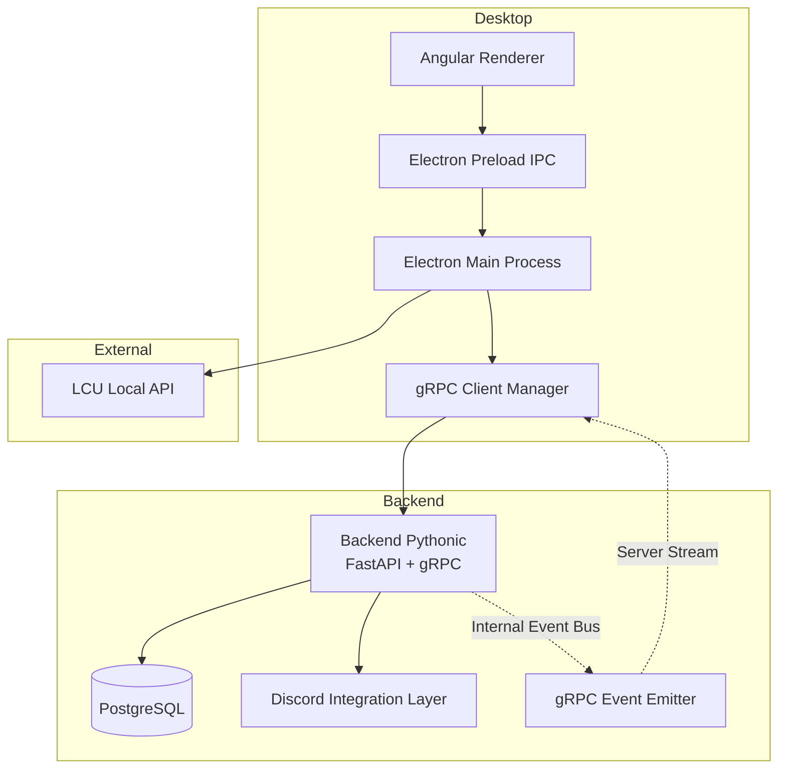
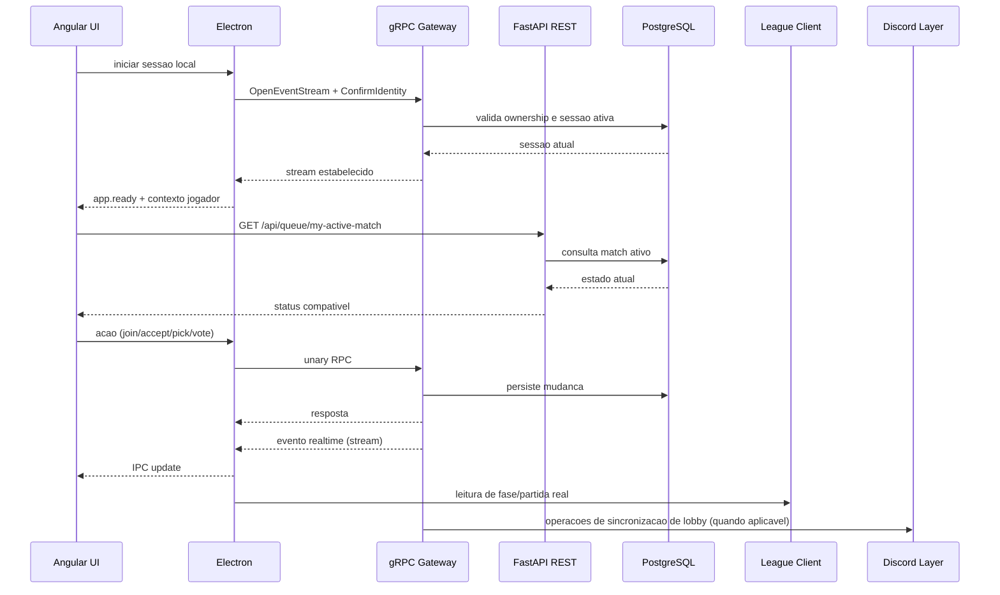
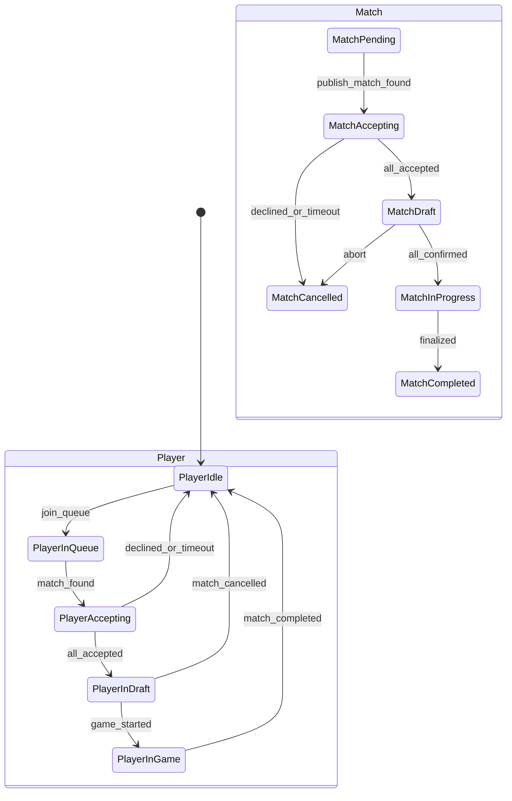
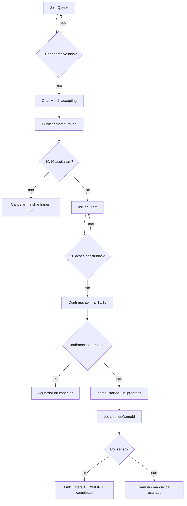
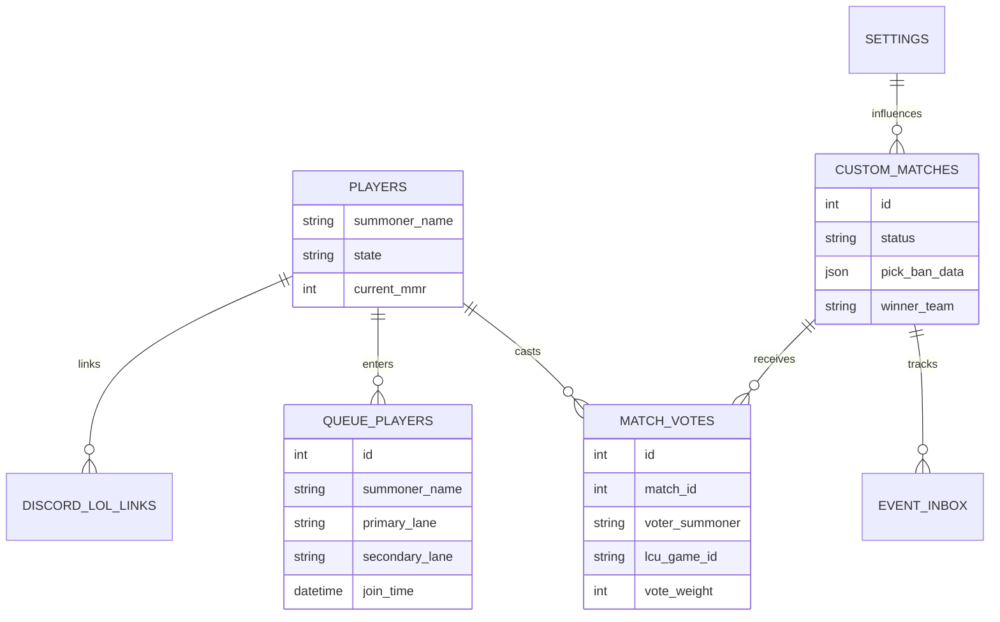
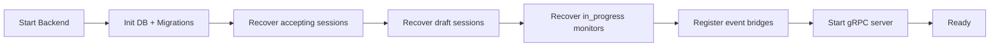
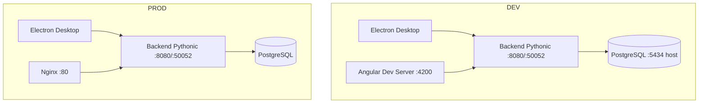

# 🎮 LOL Fazenda Inhouse - Plataforma Avancada de Matchmaking

## 🚀 Visao Geral

O **LOL Fazenda Inhouse** e uma solucao completa e inovadora de matchmaking customizado para League of Legends, projetada para operacao competitiva com consistencia tecnica e maturidade de produto.

Esta plataforma combina arquitetura desktop + backend centralizado para oferecer:

- orquestracao de fila e formacao de partidas balanceadas
- draft competitivo com regras fechadas e sincronizacao forte
- integracao desktop com League Client (LCU) via Electron
- coordenacao centralizada de estado no backend Pythonic
- fluxo de pos-jogo com consenso de vinculacao da partida real

### 🎯 Proposta de Valor

- **Experiencia operacional previsivel**: fluxo completo de ponta a ponta com regras claras de transicao de estado
- **Integridade competitiva**: controle de ownership, idempotencia e consenso de resultado
- **Escalabilidade de evolucao**: contratos estaveis para frontend e desktop, com trilha de migracao gRPC consolidada

Esta documentacao substitui o recorte antigo baseado em Java/Spring/Redis e reflete a arquitetura vigente:

- Backend: Python 3.12 + FastAPI + gRPC
- Frontend: Angular 20
- Desktop: Electron 28
- Persistencia: PostgreSQL + Alembic

---

## 🎯 1. Objetivo e Proposta de Valor

### 💼 1.1 Objetivo de negocio

Entregar uma experiencia de campeonato inhouse com previsibilidade operacional e integridade competitiva:

- reduzir friccao de organizacao de partidas customizadas
- garantir balanceamento minimo por skill e lanes
- padronizar transicao fila -> draft -> jogo -> resultado
- dar rastreabilidade de decisao (eventos, votos, idempotencia)

### 🔧 1.2 Objetivo tecnico

Manter um backend coordenador que funcione como fonte de verdade de estado, com:

- contratos estaveis para Electron e Angular
- regras de ownership por sessao
- capacidade de recuperacao apos restart/desconexao
- caminho canonico gRPC para a camada desktop

### 📌 1.3 Escopo desta versao

Inclui:

- arquitetura alvo e responsabilidades por camada
- fluxo funcional ponta a ponta
- contratos gRPC e HTTP relevantes
- modelo de dominio, estados e persistencia
- operacao, observabilidade, seguranca e riscos

Nao inclui:

- manual de UX do frontend
- guia de contribuicao de codigo
- detalhe de infraestrutura fora do repositorio atual

---

## 🏗️ 2. Arquitetura Geral da Solucao

### 🧭 2.1 Principios arquiteturais

- Angular nao acessa LCU diretamente
- Electron e a borda confiavel para identidade local e integracao com o cliente LoL
- backend centraliza regra de negocio, estado e persistencia
- gRPC e o canal principal de realtime para o desktop
- REST continua para contratos de compatibilidade e consultas

### ⚠️ 2.2 Diferencas principais vs legado

| Tema | Legado | Atual |
| --- | --- | --- |
| Backend | Java Spring Boot | Python FastAPI |
| Realtime desktop | WebSocket dominante | gRPC dominante |
| Estado temporario distribuido | Redis | Estado em memoria + DB |
| Banco principal | MySQL | PostgreSQL |
| Migracao de schema | Liquibase | Alembic |

---

## 🔄 3. Arquitetura de Comunicacao e Sincronizacao

### 📡 3.1 Canais de comunicacao oficiais

- UI -> Electron: IPC
- Electron -> Backend: gRPC (acao + stream)
- UI -> Backend: HTTP para leitura/compatibilidade
- Backend -> DB: SQLAlchemy async

### 📨 3.2 Contrato de evento no stream gRPC

Envelope logico:

- event_type
- timestamp_ms
- message_id
- payload_json
- match_id opcional

Objetivo:

- manter payload compativel com o que o frontend ja espera
- reduzir divergencia de mapeamento entre modos de execucao

---

## 🧩 4. Componentes e Responsabilidades

### 🐍 4.1 Backend Pythonic (camadas)

| Camada | Papel |
| --- | --- |
| `domain` | entidades, enums, contratos de repositorio |
| `application` | casos de uso: fila, matchmaking, draft, voto, finalizacao |
| `infrastructure` | banco, repositorios, integracoes externas, tasks |
| `interfaces` | routers REST, servicers gRPC, bridge de eventos |

### 🖥️ 4.2 Electron

| Componente | Papel |
| --- | --- |
| grpc manager | conexao, reconexao, unary calls |
| event stream handler | subscribe e fan-out para IPC |
| LCU bridge | leitura local de estado do cliente LoL |
| session coordination | custom session id e confirmacao de identidade |

### 🌐 4.3 Angular

| Area | Papel |
| --- | --- |
| queue view | entrada/saida da fila, visibilidade de status |
| match found modal | aceite/recusa e progresso |
| draft view | picks/bans/confirmacao final |
| in-game/post-game | progresso de partida e voto |

---

## 🧠 5. Modelo de Dominio Canonico

### 👤 5.1 Identidade de jogador

Identificador canonico para interoperabilidade:

- `summoner_name = gameName#tagLine`

Aliases aceitos por compatibilidade:

- `displayName`
- `summonerName` historico
- `riotId` em payloads legados

Regra obrigatoria:

- normalizacao de case e whitespace antes de comparacoes de ownership

### 🗂️ 5.2 Entidades centrais

- Player
- QueuePlayer
- Match (custom_matches)
- MatchVote
- IdempotencyRequest
- Setting
- DiscordConfig
- DiscordLolLink

### 🔋 5.3 Estados de jogador

| Estado | Semantica |
| --- | --- |
| `idle` | apto para entrar na fila |
| `in_queue` | na fila |
| `accepting_match` | em match found/aceite |
| `in_draft` | em draft/confirmacao final |
| `in_game` | partida iniciada |
| `disconnected` | precisa reconciliacao |

### 🎲 5.4 Estados de partida

| Estado | Semantica |
| --- | --- |
| `pending` | criada mas nao publicada |
| `accepting` | fase de aceite |
| `draft` | pick/ban e confirmacao final |
| `in_progress` | jogo em andamento |
| `completed` | encerrada com resultado |
| `cancelled` | cancelada por recusa/timeout/erro |

### 🧾 5.5 Diagrama de estados

---

## 🎮 6. Fluxo Funcional Ponta a Ponta

### 🚪 6.1 Inicializacao e identificacao

1. Electron sobe e gera/recupera `customSessionId`.
2. Electron abre stream gRPC (`OpenEventStream`).
3. Electron confirma identidade (`ConfirmIdentity`).
4. UI recebe contexto do jogador por IPC.
5. UI consulta `GET /api/queue/my-active-match` para restauracao.

Regras:

- backend deve recuperar estado ativo sem depender apenas de memoria
- mismatch de sessao deve bloquear acoes sensiveis

### 🧲 6.2 Entrada em fila

1. UI solicita entrada com `primaryLane` + `secondaryLane`.
2. Backend valida:
   - jogador existente
   - estado atual compativel (`idle`)
   - duplicidade de entrada
   - requisitos opcionais de Discord (quando habilitados)
3. Cria `queue_players` ativo.
4. Atualiza `Player.state = in_queue`.
5. Publica `queue_update`.

### ⚙️ 6.3 Trigger de matchmaking

Regra alvo:

- quando houver 10 jogadores elegiveis, selecionar lote fechado para formar partida

Sinais importantes:

- selecao FIFO para fairness operacional
- nao misturar jogadores em estado inconsistente
- abortar criacao caso atribuicao de lanes fique invalida

### ⚖️ 6.4 Balanceamento de times

Abordagem atual (alto nivel):

- ordenar candidatos por metrica de forca (win rate/MMR conforme implementacao)
- distribuir em padrao snake para reduzir desequilibrio
- fechar composicao de lane por time: `top`, `jungle`, `mid`, `adc`, `support`

Exemplo de padrao de distribuicao:

- B, R, R, B, B, R, R, B, B, R

### ✅ 6.5 Match found e aceite

1. Backend cria sessao de aceite com timeout (padrao 30s).
2. Publica `match_found` para os 10 jogadores.
3. A cada aceite, publica `acceptance_progress`.
4. Se houver recusa/timeout, cancela partida e limpa estado.
5. Se todos aceitarem, transita para draft.

Regras:

- aceite duplicado deve ser idempotente
- bots/special users podem auto-aceitar conforme configuracao

### 🛡️ 6.6 Draft competitivo

1. Draft inicia apos 10/10 aceite.
2. UI usa eventos (`draft_update`, `draft_updated`) + endpoint de snapshot.
3. Apos 20 acoes, abre confirmacao final dos 10 jogadores.
4. 10/10 confirmacao -> `game_started`.

#### 📋 6.6.1 Ordem canonica de draft

| Index | Team | Action | Phase |
| --- | --- | --- | --- |
| 0 | blue | ban | ban_phase_1 |
| 1 | red | ban | ban_phase_1 |
| 2 | blue | ban | ban_phase_1 |
| 3 | red | ban | ban_phase_1 |
| 4 | blue | ban | ban_phase_1 |
| 5 | red | ban | ban_phase_1 |
| 6 | blue | pick | pick_phase_1 |
| 7 | red | pick | pick_phase_1 |
| 8 | red | pick | pick_phase_1 |
| 9 | blue | pick | pick_phase_1 |
| 10 | blue | pick | pick_phase_1 |
| 11 | red | pick | pick_phase_1 |
| 12 | red | ban | ban_phase_2 |
| 13 | blue | ban | ban_phase_2 |
| 14 | red | ban | ban_phase_2 |
| 15 | blue | ban | ban_phase_2 |
| 16 | red | pick | pick_phase_2 |
| 17 | blue | pick | pick_phase_2 |
| 18 | blue | pick | pick_phase_2 |
| 19 | red | pick | pick_phase_2 |

#### ⏱️ 6.6.2 Temporizador

Regra alvo funcional:

- 45 segundos por acao de draft

Ponto de atencao:

- manter coerencia entre config, servicos, payloads REST/gRPC e UI

### 🎬 6.7 Inicio do jogo

1. Confirmacao final completa.
2. Backend marca `Match.status = in_progress`.
3. Jogadores vao para `in_game`.
4. Backend publica `game_started`.

### 🏁 6.8 Pos-jogo, voto de vinculacao e finalizacao

1. Backend abre sessao de voto de `lcuGameId` para consenso.
2. Jogadores votam no game real correspondente.
3. Com consenso, backend vincula partida real, calcula resultado final e persiste stats.
4. Sem consenso, existe caminho manual de resultado (`VoteWinner`/`ReportResult`) seguindo pipeline de finalizacao.

---

## 📜 7. Contratos gRPC (Canal Canonico Desktop)

### 🧱 7.1 Servicos principais

| Service | Metodo | Uso |
| --- | --- | --- |
| SessionService | OpenEventStream | stream unico de eventos |
| SessionService | Heartbeat | keepalive e saude de sessao |
| SessionService | ConfirmIdentity | ownership por sessao/jogador |
| SessionService | GetActiveSessions | visibilidade operacional |
| QueueService | JoinQueue / LeaveQueue | operacoes de fila |
| MatchService | AcceptMatch / DeclineMatch | fase de aceite |
| MatchService | CancelMatch | cancelamento de partida |
| MatchService | VoteGameId | consenso de vinculacao pos-jogo |
| DraftService | PickChampion / BanChampion | acao de draft |
| DraftService | ConfirmDraft | confirmacao final |
| GameService | VoteWinner / ReportResult | fallback/manual |
| DiscordService | Status / users / move ops | sincronizacao de lobby |
| LcuProxyService | SendLcuResponse | retorno de request LCU no fluxo desktop |

### 🧪 7.2 Metodos legados/unimplemented

Ainda fora do fluxo principal:

- `DraftService.SelectLane`
- `GameService.Surrender`
- `LcuProxyService.Request`

### 📣 7.3 Eventos do stream mais relevantes

- `queue_update`
- `match_found`
- `acceptance_progress`
- `match_cancelled`
- `draft_started`
- `draft_update`
- `draft_updated`
- `draft_confirmation_update`
- `game_started`
- `game_in_progress`
- `game_ended`
- `match_vote_progress`
- `match_vote_update`
- `match_linked`

Regra de roteamento:

- quando payload nao trouxer destinatarios explicitos, o backend resolve recipients por `match_id`

---

## 🔌 8. Contratos HTTP Obrigatorios para Compatibilidade

Prefixo base: `/api`

Headers criticos:

- `X-Summoner-Name`
- `X-Custom-Session-Id`
- `Idempotency-Key` (acoes criticas)

### 📥 8.1 Queue API

| Endpoint | Papel |
| --- | --- |
| `GET /queue/status` | status agregado da fila |
| `POST /queue/join` | entrar na fila |
| `POST /queue/leave` | sair da fila |
| `POST /queue/refresh` | refresh de compatibilidade |
| `POST /queue/force-sync` | sincronizacao forcada |
| `POST /queue/add-bot` | apoio a teste |
| `GET /queue/my-active-match` | restauracao de estado de sessao |

### 🆚 8.2 Match API

| Endpoint | Papel |
| --- | --- |
| `POST /match/accept` | aceitar partida |
| `POST /match/decline` | recusar partida |
| `POST /match/draft-action` | pick/ban via compatibilidade |
| `GET /match/{match_id}/draft-session` | snapshot completo do draft |
| `POST /match/{match_id}/confirm-final-draft` | confirmacao final |
| `GET /match/{match_id}/confirmation-status` | progresso de confirmacao |
| `POST /match/{match_id}/vote` | voto de `lcuGameId` |
| `GET /match/{match_id}/votes` | estado de votos |
| `POST /match/{match_id}/cancel` ou `DELETE /match/{match_id}/cancel` | cancelamento |

### 🧬 8.3 Draft API legada

| Endpoint | Status esperado |
| --- | --- |
| `POST /draft/{match_id}/changePick` | caminho de compatibilidade |
| `POST /draft/{match_id}/confirm-lane` | legado, frequentemente 501 |
| `POST /draft/{match_id}/swap-request` | legado, frequentemente 501 |
| `POST /draft/{match_id}/swap-accept` | legado, frequentemente 501 |

### 🛠️ 8.4 Admin e Config

| Endpoint | Papel |
| --- | --- |
| `GET /admin/special-user/{summoner}/status` | consulta papel especial |
| `GET /admin/special-user/{summoner}/config` | ler configuracao |
| `PUT /admin/special-user/{summoner}/config` | atualizar configuracao |
| `GET /config/status` | saude de config |
| `GET /config/settings` | configuracoes globais |
| `PUT /config/setting/{key}` | alterar config |
| `DELETE /config/setting/{key}` | remover config |

---

## 🛡️ 9. Idempotencia, Ownership e Integridade

### ♻️ 9.1 Escopos minimos idempotentes

- queue.join
- queue.leave
- match.accept
- match.decline
- draft.action
- draft.changePick
- draft.confirm
- recomendacao: vote de game id tambem idempotente

### ✅ 9.2 Garantias esperadas

- retry nao duplica efeito colateral
- mesma chave e mesmo payload devolvem resultado consistente
- mesma chave com payload diferente gera rejeicao

### 🆔 9.3 Ownership por sessao

Objetivo:

- impedir acao de usuario A em sessao/jogo de usuario B

Mecanismo:

- correlacao entre `X-Summoner-Name` + `X-Custom-Session-Id`
- validacao no ponto de entrada (REST/gRPC)
- roteamento de evento por destinatario real

---

## 🗄️ 10. Persistencia e Estrutura de Dados

### 📚 10.1 Entidades persistidas mais relevantes

| Tabela | Papel |
| --- | --- |
| `players` | cadastro e estado do jogador |
| `queue_players` | fila ativa e metadados de entrada |
| `custom_matches` | ciclo completo da partida |
| `match_votes` | votos de vinculacao e consenso |
| `idempotency_requests` | deduplicacao de operacoes |
| `settings` | comportamento dinamico |
| `discord_config` | configuracao de integracao |
| `discord_lol_links` | vinculacao Discord <-> LoL |
| `event_inbox` | suporte a resiliencia/eventos |

### 🎯 10.2 Campo estrategico

`pick_ban_data` em `custom_matches`:

- snapshot canonicamente serializado do draft e estado de jogo
- base para restauracao de UI e reconciliacao pos-restart

### 🔗 10.3 Relacoes de alto nivel

---

## 🌍 11. Integracoes Externas

### 🎯 11.1 LCU (League Client)

Uso:

- descoberta de identidade local do jogador
- leitura de estado de jogo para vinculacao de resultado

Regras:

- acesso ao LCU deve ocorrer no Electron
- backend recebe dados consolidados e opera em cima do contrato

### 💬 11.2 Discord

Uso:

- status de usuarios online
- sincronizacao de movimento para times/lobby
- validacoes opcionais de eligibility na fila

---

## 🚑 12. Operacao, Recuperacao e Resiliencia

### 🔁 12.1 Startup recovery

No startup da aplicacao backend:

- restaurar sessoes em `accepting`
- restaurar sessoes em `draft`
- restaurar partidas `in_progress`
- religar bridge de eventos para stream gRPC

### 🧵 12.2 Task critica

Task ativa por padrao no ciclo atual:

- `MatchmakingOrchestratorTask`

### ⚠️ 12.3 Falhas esperadas e comportamento

| Cenario | Comportamento esperado |
| --- | --- |
| queda de cliente durante aceite | timeout/cancelamento consistente |
| reconnect durante draft | restauracao por snapshot |
| retry de acao critica | resposta idempotente |
| stream interrompido | reconexao Electron + resume de contexto |

---

## 🔒 13. Seguranca e Governanca de Acoes

Controles minimos:

- ownership por sessao em chamadas sensiveis
- validacao de pertencimento do jogador na partida antes de pick/ban/accept
- saneamento de payload e verificacao de pre-condicao de fase
- trilha de auditoria por logs de evento e idempotency record

Risco conhecido:

- se roteamento realtime depender de payload incompleto sem resolve por `match_id`, ha risco de evento perdido para parte dos jogadores

Mitigacao:

- resolver recipients no backend por lookup da partida quando necessario

---

## 🚀 14. Topologias de Deploy

### 🧪 14.1 Desenvolvimento

- PostgreSQL: host 5434 -> container 5432
- Backend REST: 8080
- Backend gRPC: 50052
- Frontend Angular: 4200

### 🏭 14.2 Producao

- Frontend servido por nginx (porta 80)
- Backend Pythonic com REST 8080 e gRPC 50052
- PostgreSQL dedicado

---

## 📊 15. KPI Tecnicos e de Negocio

### 💼 15.1 KPI de negocio

- tempo medio para formar partida (fila -> match_found)
- taxa de partida abortada por timeout/recusa
- taxa de partida concluida com vinculacao automatica de `lcuGameId`
- tempo medio de fechamento pos-jogo

### 🧰 15.2 KPI tecnico

- latencia p95 das chamadas gRPC criticas
- latencia p95 de endpoint REST de restauracao (`my-active-match`)
- taxa de sucesso de reconexao de stream em 30s
- taxa de erro de idempotencia por payload divergente

---

## 🧪 16. Plano de Testes Recomendado

### 🔬 16.1 Unidade

- validacao de transicao de estado de jogador/partida
- idempotencia por escopo de acao
- roteamento de recipients por `match_id`

### 🌐 16.2 Integracao HTTP

- join/leave com ownership
- accept/decline com retry
- draft-action em fase invalida
- confirm-final-draft com repeticao de chave

### 📶 16.3 Integracao gRPC

- open stream + confirm identity
- sequencia match_found -> acceptance_progress -> draft_started
- resiliencia de stream apos reconexao

### 🎭 16.4 E2E operacional

- 10 jogadores completos ate `game_started`
- cancelamento por timeout com limpeza total de estado
- voto de `lcuGameId` com consenso e finalizacao completa

---

## 🚨 17. Riscos, Lacunas Conhecidas e Mitigacoes

### 🟥 17.1 Lacunas funcionais conhecidas

- alguns endpoints de draft legado ainda em 501
- RPCs legados marcados como unimplemented
- divergencias pontuais de timer/config entre componentes podem ocorrer se nao houver hardening continuo

### 🟨 17.2 Riscos operacionais

- desalinhamento de payload realtime entre backend e UI
- perda de evento em reconexao se nao houver replay/refresh de estado
- estado zumbi de jogador quando cleanup falha

### 🟩 17.3 Mitigacoes recomendadas

- contrato de payload versionado e testes de schema
- refresh deterministico de estado apos reconnect
- reconciliacao periodica de `players.state` x `queue_players` x `custom_matches`

---

## 🧭 18. Guia Rapido de Operacao

1. Subir stack backend + banco + frontend.
2. Abrir Electron e validar identificacao do jogador.
3. Confirmar saude em `/health/ready`.
4. Executar fluxo de fila ate match found.
5. Validar draft completo e confirmacao final.
6. Validar pos-jogo com voto de `lcuGameId`.

Checklist minimo de consistencia:

- jogador nao fica preso em estado invalido apos cancelamento
- idempotency evita duplicidade em retry
- `my-active-match` restaura corretamente apos restart do cliente

---

## 📎 19. Referencias Internas no Repositorio

- `ESPECIFICACAO-IMPLEMENTACAO-BACKEND-PYTHONIC.md`
- `docs/PLANO-IMPLEMENTACAO-GRPC.md`
- `backend-pythonic/FLUXO-CRITICO-FILA-MATCHMAKING.md`
- `backend-pythonic/src/app/main.py`
- `backend-pythonic/proto/lol_fazenda/gateway/v1`

---

## ✅ 20. Conclusao

O LOL Fazenda Inhouse esta consolidado como uma plataforma de matchmaking competitiva com backend Pythonic e canal realtime gRPC orientado ao desktop Electron, mantendo compatibilidade HTTP para a UI Angular.

O desenho atual privilegia:

- consistencia de estado
- recuperacao operacional
- rastreabilidade de decisao
- evolucao incremental sem quebrar contratos externos

Esta documentacao deve ser tratada como base oficial para arquitetura, fluxo funcional e contratos da stack atual.
