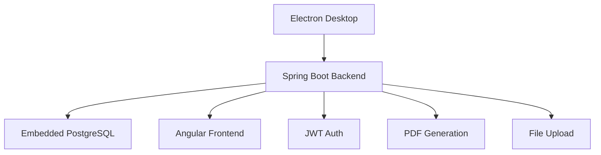

# 🧾 Mercearia R&V — Enterprise Offline-First Inventory & Sales Desktop

## 🚀 Overview

**Mercearia R&V** is an offline-first desktop solution for grocery stock and sales, built with Electron + Spring Boot + embedded PostgreSQL. It ships with Clean Architecture, JWT auth, PDF generation, and Angular Material UI, all packaged for Windows with bundled JDK/PostgreSQL.

### 🎯 Value Proposition

- **Desktop-first** with embedded backend and DB
- **100% offline-first** operation
- **Bundled PostgreSQL** inside the installer
- **Angular Material UX**
- **PDF generation** for reports/invoices
- **Complete domain**: products, sales, customers, reports

## 🏗️ Architecture



### Startup Flow

1. Electron starts and shows splash
2. Spring Boot boots with embedded PostgreSQL
3. Health check gates UI load
4. Angular SPA loads
5. User logs in (JWT)
6. App ready for offline operation

## 🧱 Tech Stack

### Backend (Spring Boot 3.5.5, Java 21)

- Spring Web/Data JPA/Security/Validation
- PostgreSQL + Liquibase
- JWT (jjwt), Lombok, Maven
- PDF generation: OpenHTMLToPDF, PDFBox

### Frontend (Angular 20 + TS)

- Angular Material 20, CDK, SCSS, Animations
- Chart.js + ng2-charts, PDF.js for viewing

### Desktop (Electron 27 + TS)

- electron-builder, NSIS installer
- Splash screen, health checks, process orchestration

### DevOps

- Mono-repo scripts (Node) for builds
- NGINX optional for web deploy, Certbot for SSL
- Health endpoints, structured logging

## 🎯 Domains & Features

- **Products/Stock**: CRUD, categories, images, stock alerts
- **Sales/Checkout**: PDV UI, multiple payments, returns, receipts (PDF)
- **Customers**: Full profile + purchase history
- **Reports**: Dashboards, PDF exports, sales analytics
- **Security**: JWT auth, roles (Admin/Operator), audit logs
- **Backups**: Embedded PostgreSQL backup scheduling

## 🔧 Highlighted Systems

- **Desktop orchestration**: splash, health checks, coordinated start/stop
- **Embedded PostgreSQL** bundled binaries, zero external deps
- **PDF service** with HTML templates
- **Liquibase** migrations with seed data
- **Performance**: HikariCP, caching, OnPush/trackBy in Angular

## 🚀 Build & Run

```bash
npm run build:all      # frontend + backend + electron
npm run dist:win       # Windows installer
npm run dev            # dev mode (frontend + backend)
```

## 📈 Metrics & Monitoring

- `/health`, Actuator health/info
- Structured file-based logging
- Dashboards (Chart.js) for key KPIs

## 🛠️ Skills Demonstrated

Java 21/Spring Boot, PostgreSQL + Liquibase, JWT security, PDF generation, Angular 20 + Material, Electron packaging, offline-first desktop orchestration, Docker/NGINX/SSL, automated builds.

---
Built with ❤️ for offline-first enterprise retail.
