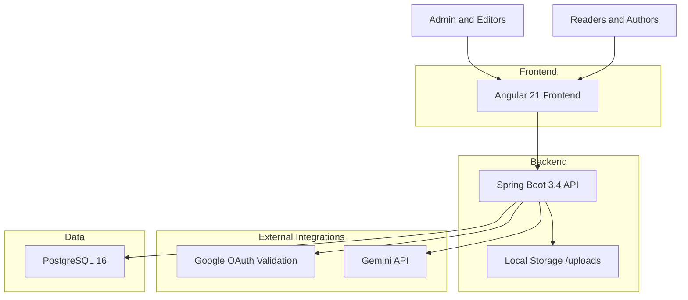
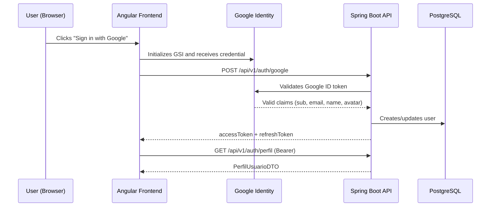
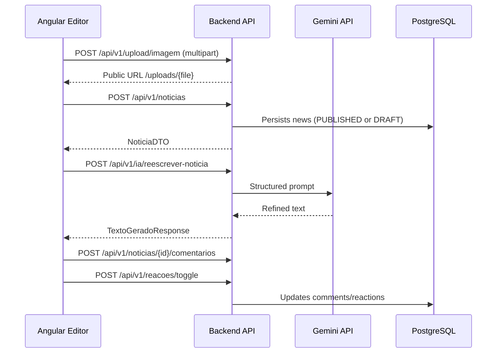

# 📰 Publique Sua Noticia Popular - Complete Technical Documentation

## 🚀 Overview

**Publique Sua Noticia Popular** is a full-stack platform for creating, editing, publishing, and consuming news content, with Google social authentication, administrative capabilities, and AI-powered editorial assistance.

The project is organized with strong separation of concerns, using domain-based backend modules (Clean Architecture style) and an Angular frontend with standalone components, reactive state via signals, and a modern publishing experience.

### 🎯 Value Proposition

- **Fast news publishing** with a block-based editor
- **Complete social flow**: comments and likes on news and comments
- **Google Auth + JWT** with role-based access control (USER/ADMIN)
- **Editorial AI assistant** for generating and refining text, titles, and subheads
- **Containerized operations** for development and production

## 🏗️ High-Level Architecture



### Main System Flow

```text
1. User opens the Angular frontend
2. Google login is executed in the browser
3. Backend validates Google token and issues JWT (access + refresh)
4. User navigates through the public news feed
5. Authenticated user publishes/edits news in the block editor
6. News can receive likes and comments
7. AI can assist with writing and content refinement
8. Administrators manage users, categories, and indicators
```

## 🔄 Communication Architecture

### Authentication and Session Flow



### Publishing and Interaction Flow



## 🧱 Technology Stack

### Backend (Java + Spring)

- Java 21
- Spring Boot 3.4.1
- Spring Web + Validation + Security + Actuator
- Spring Data JPA + Hibernate
- Liquibase for schema versioning
- JWT with `jjwt`
- WebClient (Spring WebFlux) for Gemini integration
- Google token validation with `google-api-client`

### Frontend (Angular)

- Angular 21.2 (standalone components)
- TypeScript 5.9
- Signals + zoneless change detection
- HttpClient with auth/error interceptors
- Dark glassmorphism visual style

### Database and Infrastructure

- PostgreSQL 16
- Docker / Docker Compose (dev and prod)
- Nginx for production frontend delivery

## 🧩 Code Organization

### Backend by Domain Modules

Recurring module structure:

```text
<module>/
  application/
    dtos/
    ports/
    usecases/
  domain/
    entities/
    valueobjects/
    exceptions/
  infrastructure/
    web/
    persistence/
    adapters/
```

Main modules:

- `autenticacao`
- `noticias`
- `categorias`
- `comentarios`
- `reacoes`
- `inteligenciaartificial`
- `admin`
- `kernel` (security, CORS, global exception handling, filters)

### Frontend by Features

- `components/feed` (home, filters, pagination)
- `components/editor` (create/edit with blocks and AI)
- `components/noticia-detalhe` (reading + reactions)
- `components/comentarios` (CRUD + likes)
- `components/admin/*` (dashboard, users, categories)
- `services/*` (API integration)
- `core/guards` and `core/interceptors`

## 🎯 Core Features

### 1. Authentication and Authorization

- Login through Google Identity Services
- Backend validates Google ID token and issues JWT
- Access token + refresh token
- Role policy:
  - `USUARIO` by default
  - promotion to `ADMIN` via `ADMIN_GOOGLE_EMAILS`
- Admin routes protected by ADMIN role

### 2. News Management

- Public feed with category, search, and ordering:
  - `MAIS_RECENTE`
  - `MAIS_ANTIGO`
  - `MAIS_VISTO`
  - `MAIS_CURTIDO`
- News creation with immediate publish option
- Edit and delete by author or admin
- View counter increment on detail access
- "My Publications" area with pagination

### 3. Block-Based Editor

- Content block types:
  - paragraph
  - headings (h1/h2/h3)
  - quote
  - list
  - inline image
- Cover and inline image uploads
- Vertical cover image positioning (`coverY`)
- Slash menu for formatting and AI actions

### 4. Comments and Reactions

- Comments per news article
- Comment ordering by:
  - newest
  - oldest
  - most liked
- Toggle likes for:
  - news
  - comments
- Comment delete permission:
  - comment author
  - administrator

### 5. Artificial Intelligence (Gemini)

Available AI endpoints:

- generate image
- generate text
- refine text
- rewrite article
- improve title
- improve subheadline

Observed behavior:

- Text generation uses Gemini through WebClient
- Image generation currently returns fallback URL (`picsum`) in the adapter

### 6. Administrative Module

- Consolidated dashboard:
  - total users
  - total news
  - published news
  - draft news
  - total categories
- User listing and activation/deactivation
- Essential category CRUD (create, update, deactivate)

## 🔐 Security, Validation, and Resilience

### HTTP Security

- Stateless API with JWT Bearer
- Public routes:
  - `/api/v1/auth/**`
  - `GET /api/v1/categorias/**`
  - `GET /api/v1/noticias/**`
  - `/uploads/**`
  - `/actuator/health`, `/actuator/info`
- Protected routes:
  - `/api/v1/admin/**` requires ADMIN role
  - all others require authentication

### Input Validation

- DTOs using Bean Validation (`@NotBlank`, `@Size`, `@NotNull`)
- Examples:
  - news title up to 255 chars
  - summary up to 500 chars
  - comment up to 1000 chars

### Error Handling

- Centralized `GlobalExceptionHandler` with standardized payload
- Specific error categories for:
  - entity not found
  - business rule violation
  - validation
  - access denied
  - internal error

### Observability

- `X-Request-Id` in all responses via `RequestIdFilter`
- Actuator enabled for health/info/metrics

## 🗄️ Data Model and Migrations

### Main Tables

- `usuarios`
- `refresh_tokens`
- `categorias`
- `noticias`
- `comentarios`
- `reacoes`

### Modeling Highlights

- `categorias` seeded via Liquibase data changelog
- `noticias` status values (`RASCUNHO`, `PUBLICADA`, `ARQUIVADA`)
- `reacoes` uniqueness on `(usuario_id, alvo_tipo, alvo_id)`
- `comentarios.noticia_id` with delete cascade

## 🌐 API Surface (Summary)

### Authentication

- `POST /api/v1/auth/google`
- `POST /api/v1/auth/refresh`
- `GET /api/v1/auth/perfil`

### News

- `GET /api/v1/noticias`
- `GET /api/v1/noticias/{id}`
- `GET /api/v1/noticias/minhas`
- `POST /api/v1/noticias`
- `PUT /api/v1/noticias/{id}`
- `DELETE /api/v1/noticias/{id}`

### Comments and Reactions

- `GET /api/v1/noticias/{noticiaId}/comentarios`
- `POST /api/v1/noticias/{noticiaId}/comentarios`
- `DELETE /api/v1/noticias/{noticiaId}/comentarios/{comentarioId}`
- `POST /api/v1/reacoes/toggle`

### Categories

- `GET /api/v1/categorias`
- `POST /api/v1/categorias` (ADMIN)
- `PUT /api/v1/categorias/{id}` (ADMIN)
- `DELETE /api/v1/categorias/{id}` (ADMIN)

### AI

- `POST /api/v1/ia/gerar-imagem`
- `POST /api/v1/ia/gerar-texto`
- `POST /api/v1/ia/refinar-texto`
- `POST /api/v1/ia/reescrever-noticia`
- `POST /api/v1/ia/melhorar-titulo`
- `POST /api/v1/ia/melhorar-submanchete`

### Admin

- `GET /api/v1/admin/dashboard`
- `GET /api/v1/admin/usuarios`
- `PATCH /api/v1/admin/usuarios/{id}`

### Upload

- `POST /api/v1/upload/imagem`
- `DELETE /api/v1/upload/imagem/{nomeArquivo}`

## 🐳 Run and Deployment

### Local Development

Main files:

- `docker-compose.yml`
- `backend/Dockerfile.dev`
- `frontend/Dockerfile.dev`

Services:

- PostgreSQL
- Spring Boot backend (with debug port 5005)
- Angular frontend (host port 4300)
- pgAdmin (optional `tools` profile)

### Production

Main files:

- `docker-compose.prod.yml`
- `backend/Dockerfile` (multi-stage)
- `frontend/Dockerfile` (Angular build + nginx)

Characteristics:

- memory limits per service
- frontend served by nginx
- backend healthcheck through actuator

## ⚙️ Relevant Environment Variables

- Database:
  - `PG_DATABASE`, `PG_USER`, `PG_PASSWORD`, `PG_HOST_PORT`
- Backend:
  - `BACKEND_HOST_PORT`, `CORS_ORIGINS`
- Security:
  - `JWT_SECRET`, `JWT_EXPIRATION`
- Google OAuth:
  - `GOOGLE_CLIENT_ID`, `GOOGLE_CLIENT_SECRET`, `ADMIN_GOOGLE_EMAILS`
- AI:
  - `GEMINI_API_KEY`
- Frontend runtime/build:
  - `NG_APP_API_URL`
  - `NG_APP_GOOGLE_CLIENT_ID`

## 🧪 Quality and Tests

The backend includes testing dependencies for:

- Spring Boot Test
- Spring Security Test
- ArchUnit
- Testcontainers (including PostgreSQL)

The frontend uses:

- Angular test runner
- Vitest as a project dependency

## 📈 Technical Strengths

- Strong domain and use case separation
- Consistent security flow across frontend and backend
- Feed and comments ordered by popularity (likes)
- Rich editor with efficient publishing flow
- Docker infrastructure ready for dev/prod

## ⚠️ Current Technical Notes

- The AI image generation adapter currently returns a random fallback URL.
- JWT secret must be valid Base64 for HMAC signing to work correctly.
- The frontend depends on `environment.generated.ts` (generated script) for API URL and Google Client ID.

---

## Built to democratize high-quality, fast, collaborative news publishing
