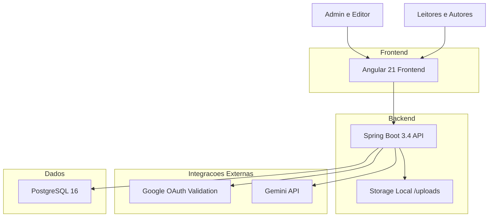
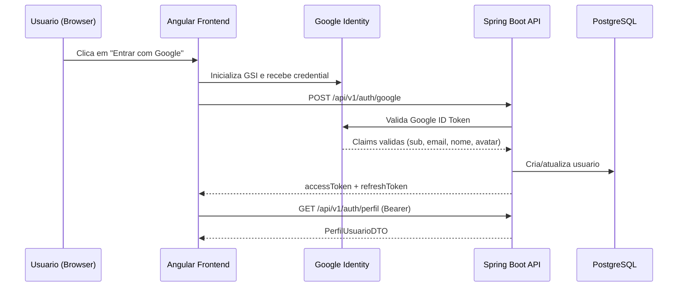
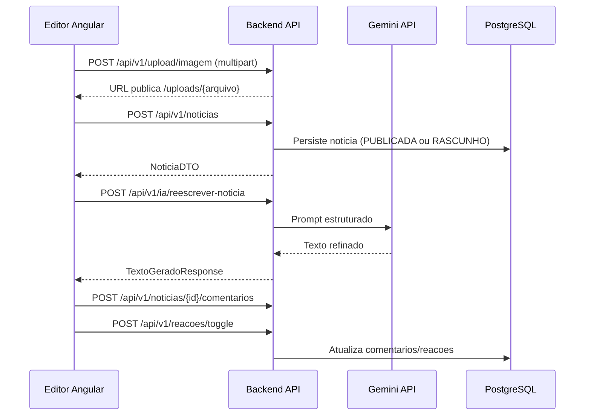

# 📰 Publique Sua Notícia Popular - Documentação Técnica Completa

## 🚀 Visão Geral

O **Publique Sua Notícia Popular** é uma plataforma full-stack para criação, edição, publicação e consumo de notícias, com autenticação social via Google, suporte administrativo e recursos de inteligência artificial para aceleração editorial.

O projeto foi implementado com foco em separação de responsabilidades, adotando módulos por domínio no backend (estilo Clean Architecture) e frontend Angular com componentes standalone, estado reativo com signals e experiência moderna de publicação.

### 🎯 Proposta de Valor

- **Publicação rápida de notícias** com editor em blocos
- **Fluxo social completo**: comentários e curtidas em notícias/comentários
- **Autenticação Google + JWT** com controle de acesso por papel (USUARIO/ADMIN)
- **Assistente de IA editorial** para gerar/refinar texto, título e submanchete
- **Operação containerizada** para desenvolvimento e produção

## 🏗️ Arquitetura de Alto Nível



### Fluxo Principal do Sistema

```text
1. Usuário acessa o frontend Angular
2. Login Google é realizado no browser
3. Backend valida token Google e emite JWT (access + refresh)
4. Usuário navega no feed público de notícias
5. Usuário autenticado publica/edita notícia via editor em blocos
6. Notícias podem receber curtidas e comentários
7. IA pode auxiliar na escrita e refinamento de conteúdo
8. Administradores gerenciam usuários, categorias e indicadores
```

## 🔄 Arquitetura de Comunicação

### Fluxo de Autenticação e Sessão



### Fluxo de Publicação e Interação



## 🧱 Stack Tecnológica

### Backend (Java + Spring)

- Java 21
- Spring Boot 3.4.1
- Spring Web + Validation + Security + Actuator
- Spring Data JPA + Hibernate
- Liquibase para versionamento de schema
- JWT com `jjwt`
- WebClient (Spring WebFlux) para integração Gemini
- Validação de token Google com `google-api-client`

### Frontend (Angular)

- Angular 21.2 (standalone components)
- TypeScript 5.9
- Signals + zoneless change detection
- HttpClient com interceptors de auth/erro
- UI com tema dark glassmorphism

### Banco e Infraestrutura

- PostgreSQL 16
- Docker / Docker Compose (dev e prod)
- Nginx para entrega do frontend em produção

## 🧩 Organização de Código

### Backend por Módulos de Domínio

Estrutura recorrente por módulo:

```text
<modulo>/
  application/
    dtos/
    ports/
    usecases/
  domain/
    entities/
    valueobjects/
    exceptions/
  infrastructure/
    web/
    persistence/
    adapters/
```

Módulos principais:

- `autenticacao`
- `noticias`
- `categorias`
- `comentarios`
- `reacoes`
- `inteligenciaartificial`
- `admin`
- `kernel` (segurança, CORS, exceções globais, filtros)

### Frontend por Features

- `components/feed` (home, filtros e paginação)
- `components/editor` (criação/edição com blocos e IA)
- `components/noticia-detalhe` (leitura + reação)
- `components/comentarios` (CRUD + likes)
- `components/admin/*` (dashboard, usuários, categorias)
- `services/*` (integração com API)
- `core/guards` e `core/interceptors`

## 🎯 Funcionalidades Principais

### 1. Autenticação e Autorização

- Login via Google Identity Services
- Backend valida ID token Google e emite JWT
- Access token + refresh token
- Políticas de papel:
  - `USUARIO` por padrão
  - promoção para `ADMIN` por e-mail configurado em `ADMIN_GOOGLE_EMAILS`
- Rotas administrativas protegidas por role ADMIN

### 2. Gestão de Notícias

- Feed público com filtros por categoria, busca e ordenação:
  - `MAIS_RECENTE`
  - `MAIS_ANTIGO`
  - `MAIS_VISTO`
  - `MAIS_CURTIDO`
- Criação de notícia com opção de publicar imediatamente
- Edição e exclusão por autor ou admin
- Incremento de visualizações no acesso ao detalhe
- Área "Minhas Publicações" com paginação

### 3. Editor em Blocos

- Blocos de conteúdo:
  - parágrafo
  - títulos (h1/h2/h3)
  - citação
  - lista
  - imagem inline
- Upload de capa e imagens inline
- Ajuste de posição vertical da imagem de capa (`coverY`)
- Slash menu para formatação e ações de IA

### 4. Comentários e Reações

- Comentários por notícia
- Ordenação de comentários por:
  - mais recentes
  - mais antigos
  - mais curtidos
- Curtidas com toggle para:
  - notícia
  - comentário
- Permissão de exclusão de comentário:
  - autor do comentário
  - administrador

### 5. Inteligência Artificial (Gemini)

Endpoints de IA disponíveis:

- gerar imagem
- gerar texto
- refinar texto
- reescrever notícia
- melhorar título
- melhorar submanchete

Comportamentos observados:

- Geração de texto usa Gemini via WebClient
- Geração de imagem hoje retorna URL fallback (`picsum`) no adapter atual

### 6. Módulo Administrativo

- Dashboard consolidado:
  - total de usuários
  - total de notícias
  - notícias publicadas
  - notícias em rascunho
  - total de categorias
- Listagem de usuários e ativação/desativação
- CRUD essencial de categorias (criar, atualizar, desativar)

## 🔐 Segurança, Validação e Resiliência

### Segurança HTTP

- API stateless com JWT Bearer
- Rotas públicas:
  - `/api/v1/auth/**`
  - `GET /api/v1/categorias/**`
  - `GET /api/v1/noticias/**`
  - `/uploads/**`
  - `/actuator/health`, `/actuator/info`
- Rotas protegidas:
  - `/api/v1/admin/**` requer role ADMIN
  - demais exigem autenticação

### Validações de Entrada

- DTOs com Bean Validation (`@NotBlank`, `@Size`, `@NotNull`)
- Exemplos:
  - título da notícia até 255 chars
  - resumo até 500 chars
  - comentário até 1000 chars

### Tratamento de Erros

- `GlobalExceptionHandler` centralizado com payload padronizado
- Códigos específicos para:
  - entidade não encontrada
  - regra de negócio
  - validação
  - acesso negado
  - erro interno

### Observabilidade

- `X-Request-Id` em todas as respostas via `RequestIdFilter`
- Actuator habilitado para health/info/metrics

## 🗄️ Modelo de Dados e Migrations

### Tabelas Principais

- `usuarios`
- `refresh_tokens`
- `categorias`
- `noticias`
- `comentarios`
- `reacoes`

### Destaques de Modelagem

- `categorias` seeded via Liquibase data changelog
- `noticias` possui status (`RASCUNHO`, `PUBLICADA`, `ARQUIVADA`)
- `reacoes` possui unicidade por `(usuario_id, alvo_tipo, alvo_id)`
- `comentarios.noticia_id` com delete cascade

## 🌐 Superfície de API (Resumo)

### Autenticação

- `POST /api/v1/auth/google`
- `POST /api/v1/auth/refresh`
- `GET /api/v1/auth/perfil`

### Notícias

- `GET /api/v1/noticias`
- `GET /api/v1/noticias/{id}`
- `GET /api/v1/noticias/minhas`
- `POST /api/v1/noticias`
- `PUT /api/v1/noticias/{id}`
- `DELETE /api/v1/noticias/{id}`

### Comentários e Reações

- `GET /api/v1/noticias/{noticiaId}/comentarios`
- `POST /api/v1/noticias/{noticiaId}/comentarios`
- `DELETE /api/v1/noticias/{noticiaId}/comentarios/{comentarioId}`
- `POST /api/v1/reacoes/toggle`

### Categorias

- `GET /api/v1/categorias`
- `POST /api/v1/categorias` (ADMIN)
- `PUT /api/v1/categorias/{id}` (ADMIN)
- `DELETE /api/v1/categorias/{id}` (ADMIN)

### IA

- `POST /api/v1/ia/gerar-imagem`
- `POST /api/v1/ia/gerar-texto`
- `POST /api/v1/ia/refinar-texto`
- `POST /api/v1/ia/reescrever-noticia`
- `POST /api/v1/ia/melhorar-titulo`
- `POST /api/v1/ia/melhorar-submanchete`

### Admin

- `GET /api/v1/admin/dashboard`
- `GET /api/v1/admin/usuarios`
- `PATCH /api/v1/admin/usuarios/{id}`

### Upload

- `POST /api/v1/upload/imagem`
- `DELETE /api/v1/upload/imagem/{nomeArquivo}`

## 🐳 Execução e Deploy

### Desenvolvimento Local

Arquivos principais:

- `docker-compose.yml`
- `backend/Dockerfile.dev`
- `frontend/Dockerfile.dev`

Serviços:

- PostgreSQL
- Backend Spring Boot (com debug port 5005)
- Frontend Angular (porta 4300 no host)
- pgAdmin (profile opcional `tools`)

### Produção

Arquivos principais:

- `docker-compose.prod.yml`
- `backend/Dockerfile` (multi-stage)
- `frontend/Dockerfile` (build Angular + nginx)

Características:

- limites de memória por serviço
- frontend servido por nginx
- healthcheck de backend via actuator

## ⚙️ Variáveis de Ambiente Relevantes

- Banco:
  - `PG_DATABASE`, `PG_USER`, `PG_PASSWORD`, `PG_HOST_PORT`
- Backend:
  - `BACKEND_HOST_PORT`, `CORS_ORIGINS`
- Segurança:
  - `JWT_SECRET`, `JWT_EXPIRATION`
- Google OAuth:
  - `GOOGLE_CLIENT_ID`, `GOOGLE_CLIENT_SECRET`, `ADMIN_GOOGLE_EMAILS`
- IA:
  - `GEMINI_API_KEY`
- Frontend runtime/build:
  - `NG_APP_API_URL`
  - `NG_APP_GOOGLE_CLIENT_ID`

## 🧪 Qualidade e Testes

O backend está preparado com dependências de teste para:

- Spring Boot Test
- Spring Security Test
- ArchUnit
- Testcontainers (incluindo PostgreSQL)

O frontend utiliza:

- Runner de testes via Angular builder
- Vitest como dependência de projeto

## 📈 Pontos Fortes Técnicos

- Boa separação por domínio e casos de uso
- Segurança consistente entre frontend e backend
- Feed e comentários com ordenação por popularidade (likes)
- Editor rico com fluxo de publicação eficiente
- Infra Docker pronta para dev/prod

## ⚠️ Observações Técnicas Atuais

- O adapter de geração de imagem IA retorna fallback randômico no estado atual.
- JWT secret deve estar em Base64 válido para assinatura HMAC funcionar corretamente.
- O frontend depende de `environment.generated.ts` (gerado por script) para API URL e Google Client ID.

---

## Feito para democratizar a criação de notícias com qualidade, velocidade e colaboração
